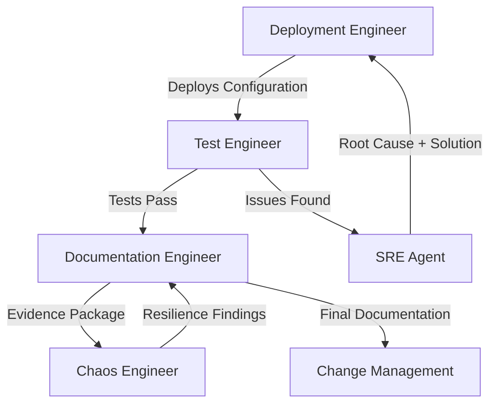

# Istio Service Mesh Agent Team - Enterprise DevOps Workflow

## Executive Summary

This plan outlines a specialized agent team that mirrors real-world enterprise DevOps practices for deploying, testing, and operating Istio service mesh components on Azure Kubernetes Service (AKS) with the Istio add-on. The team follows a proper handoff process between deployment, testing, SRE troubleshooting, documentation, and chaos engineering.

## Infrastructure Prerequisites

### Minikube Development Environment

- **DNS Zone**: `/subscriptions/133d5755-4074-4d6e-ad38-eb2a6ad12903/resourceGroups/dns/providers/Microsoft.Network/dnszones/davidmarkgardiner.co.uk`
- **Cert-Manager**: Already installed and configured
- **Azure Service Operator**: Already installed and configured
- **External-DNS**: For automated DNS record management with Azure DNS
- **Test Applications**: Multi-version applications for comprehensive testing

### AKS Production Environment

- **AKS Cluster**: With Istio add-on enabled
- **Azure DNS Integration**: Automated via External-DNS
- **Multi-Tenant Namespaces**: tenant-a, tenant-b, shared-services
- **Monitoring Stack**: For observability and troubleshooting

## Enterprise Agent Team Structure

### Agent 1: Deployment Engineer

**Primary Role**: Istio CRD specialist and multi-namespace deployment expert

**Responsibilities**:

- Deep expertise in all six Istio CRDs (VirtualService, DestinationRule, Gateway, ServiceEntry, Sidecar, AuthorizationPolicy)
- Deploy complex multi-tenant configurations across namespaces
- Implement progressive traffic management strategies
- Configure ingress gateways with TLS and certificate automation
- Set up service mesh security policies and multi-tenant isolation
- Collaborate with SRE when deployment issues arise

**Key Deployment Scenarios**:

```yaml
# Multi-tenant namespace deployment pattern
# Tenant A: Production workloads with strict security
# Tenant B: Development workloads with relaxed policies
# Shared Services: Common infrastructure (logging, monitoring, auth)
```

**Deliverables**:

- Complete multi-tenant Istio configurations
- Gateway and VirtualService routing implementations
- Authorization policies for namespace isolation
- Destination rules with circuit breakers and load balancing
- Service entries for external dependencies
- Sidecar configurations for performance optimization

### Agent 2: Test Engineer

**Primary Role**: Ingress traffic validation and functional testing

**Responsibilities**:

- Execute comprehensive ingress endpoint testing
- Validate HTTPS certificates and TLS termination
- Test multi-tenant routing and isolation
- Perform load balancing and failover validation
- Monitor application health and performance metrics
- **Escalation**: Report issues to SRE Agent for investigation

**Primary Test Categories**:

```bash
# Functional Tests
- HTTPS certificate validation
- Host-based routing verification
- Path-based routing validation
- Load balancing distribution
- Circuit breaker functionality
- Authorization policy enforcement

# Integration Tests
- DNS resolution and propagation
- Certificate auto-renewal
- Cross-namespace communication
- External service connectivity
```

**Success Criteria**:

- All ingress endpoints return 200 OK with valid TLS
- Traffic routing matches configured policies
- Security boundaries properly enforced
- Performance metrics within acceptable ranges

**Escalation Process**:

```yaml
Issue Detection → Gather Evidence → Create Incident Report → Hand to SRE
```

### Agent 3: SRE (Site Reliability Engineer)

**Primary Role**: Production troubleshooting and root cause analysis

**Responsibilities**:

- Investigate issues escalated from Test Engineer
- Perform root cause analysis using Istio observability tools
- Debug complex service mesh networking issues
- Analyze Envoy proxy configurations and logs
- Troubleshoot certificate and DNS problems
- **Handback**: Provide solutions and recommendations to Deployment Engineer

**SRE Investigation Workflow**:

```bash
#!/bin/bash
# SRE Troubleshooting Playbook

echo "🔍 SRE Investigation Started"

# Step 1: Gather system state
kubectl get pods,svc,gw,vs,dr -A
istioctl proxy-status
istioctl proxy-config cluster,listener,route <pod-name>

# Step 2: Check Envoy logs
kubectl logs -l istio=ingressgateway -n istio-system -c istio-proxy

# Step 3: Validate configurations
istioctl analyze
istioctl x describe pod <pod-name>

# Step 4: Network connectivity testing
kubectl exec -it <test-pod> -- nslookup <service>
kubectl exec -it <test-pod> -- curl -v <endpoint>

# Step 5: Certificate validation
kubectl get secrets -n istio-system
openssl s_client -connect <host>:443 -servername <host>

# Step 6: Generate findings report
echo "📋 Root Cause Analysis Complete"
```

**SRE Handback Process**:

1. **Root Cause Identification**: Document exact cause of failure
2. **Solution Recommendation**: Provide specific configuration fixes
3. **Prevention Measures**: Suggest monitoring and alerting improvements
4. **Knowledge Transfer**: Brief Deployment Engineer on resolution

### Agent 4: Documentation Engineer

**Primary Role**: Evidence collection and change management preparation

**Responsibilities**:

- Document all successful deployments with evidence
- Create comprehensive configuration guides
- Maintain deployment runbooks and troubleshooting guides
- Prepare change management documentation
- Track configuration changes and version history
- **Integration**: Incorporate chaos engineering findings into documentation

**Documentation Categories**:

#### Deployment Evidence Package

```markdown
# Istio Multi-Tenant Deployment - Evidence Report

## Deployment Summary

- **Date**: 2025-01-XX
- **Engineer**: Agent 1 (Deployment)
- **Environment**: AKS Production
- **Components**: 6 Istio CRDs across 3 namespaces

## Test Results (from Test Engineer)

- ✅ All ingress endpoints accessible
- ✅ TLS certificates valid and auto-renewing
- ✅ Multi-tenant isolation working
- ✅ Load balancing distributing traffic
- ✅ Circuit breakers functioning

## Configuration Files

- [gateway.yaml] - HTTPS ingress configuration
- [virtual-service.yaml] - Traffic routing rules
- [authorization-policy.yaml] - Security policies
- [destination-rule.yaml] - Circuit breaker settings

## Change Management Checklist

- [ ] Security review completed
- [ ] Performance benchmarks documented
- [ ] Rollback procedures tested
- [ ] Monitoring alerts configured
```

#### Troubleshooting Runbooks

```markdown
# Common Istio Issues - SRE Runbook

## Issue: 503 Service Unavailable

**Symptoms**: Ingress returns 503 errors
**Investigation**: Check Envoy upstream clusters
**Resolution**: Validate DestinationRule subsets
**Prevention**: Monitor upstream health

## Issue: Certificate Not Found

**Symptoms**: TLS handshake failures  
**Investigation**: Check cert-manager logs
**Resolution**: Verify DNS propagation
**Prevention**: Set up certificate monitoring
```

**Change Management Integration**:

- Risk assessments based on chaos engineering findings
- Rollback procedures validated through testing
- Business impact documentation
- Compliance and security attestations

### Agent 5: Chaos Engineer

**Primary Role**: Resilience testing and failure scenario validation

**Responsibilities**:

- Design and execute controlled failure scenarios
- Test infrastructure resilience and recovery capabilities
- Validate failover and disaster recovery procedures
- Stress test circuit breakers and rate limiting
- **Reporting**: Document findings and recommendations to Documentation Engineer

**Chaos Engineering Scenarios**:

#### Infrastructure Failures

```bash
#!/bin/bash
# Chaos Engineering Test Suite

echo "💥 Starting Chaos Engineering Tests"

# Scenario 1: Pod Failure Testing
echo "Test 1: Random pod termination"
kubectl delete pod -l app=web-app -n tenant-a --random
# Monitor recovery time and traffic impact

# Scenario 2: Node Failure Simulation
echo "Test 2: Node drain simulation"
kubectl drain <node-name> --ignore-daemonsets
# Test workload redistribution

# Scenario 3: Network Partitioning
echo "Test 3: Network policy chaos"
# Apply temporary restrictive network policies
# Measure impact on inter-service communication

# Scenario 4: Certificate Expiration
echo "Test 4: Certificate rotation stress test"
kubectl delete secret davidmarkgardiner-tls-cert -n istio-system
# Monitor cert-manager recovery and downtime

# Scenario 5: Gateway Overload
echo "Test 5: Ingress gateway stress test"
# Generate high traffic load to trigger circuit breakers
# Validate rate limiting and backpressure mechanisms

# Scenario 6: DNS Failures
echo "Test 6: DNS resolution chaos"
# Temporary DNS misconfiguration
# Test service discovery resilience
```

#### Security Chaos Testing

```bash
#!/bin/bash
# Security Resilience Testing

# Test 1: Authorization policy stress
# Apply conflicting authorization rules
# Verify security boundaries remain intact

# Test 2: JWT token chaos
# Inject expired/malformed tokens
# Validate authentication pipeline resilience

# Test 3: mTLS disruption
# Temporarily break certificate chains
# Test automatic recovery mechanisms
```

**Chaos Findings Report Template**:

```yaml
Test: Pod Failure Recovery
Result: ✅ PASS
Recovery Time: 12 seconds
Impact: Zero downtime
Recommendation: Consider faster readiness probes

Test: Certificate Rotation
Result: ⚠️ PARTIAL
Recovery Time: 45 seconds
Impact: Brief TLS errors
Recommendation: Implement certificate pre-rotation
```

## Enterprise Workflow Process

### Phase 1: Infrastructure Setup

1. **Minikube Environment**: Deployment Engineer sets up development environment
2. **AKS Deployment**: Deployment Engineer provisions AKS with Istio add-on
3. **Base Configuration**: DNS, certificates, and monitoring integration

### Phase 2: Multi-Tenant Deployment

1. **Deployment Engineer**: Creates comprehensive multi-tenant Istio configurations
2. **Namespace Strategy**: tenant-a (prod), tenant-b (dev), shared-services (infra)
3. **Security Implementation**: Authorization policies and network isolation
4. **Traffic Management**: Gateways, routing, and load balancing

### Phase 3: Validation & Testing

1. **Test Engineer**: Executes comprehensive ingress and functionality tests
2. **Success Path**: All tests pass → Hand to Documentation Engineer
3. **Failure Path**: Issues detected → **Escalate to SRE Agent**

### Phase 4: SRE Investigation (When Issues Arise)

1. **SRE Agent**: Receives detailed issue report from Test Engineer
2. **Root Cause Analysis**: Deep troubleshooting using Istio observability
3. **Solution Development**: Create specific fixes and recommendations
4. **Handback**: **Return to Deployment Engineer** with solutions

### Phase 5: Documentation & Evidence

1. **Documentation Engineer**: Collects evidence of working configurations
2. **Change Management Prep**: Creates comprehensive deployment documentation
3. **Runbook Creation**: Documents troubleshooting procedures from SRE findings
4. **Compliance Documentation**: Prepares security and operational attestations

### Phase 6: Chaos Engineering & Resilience

1. **Chaos Engineer**: Executes controlled failure scenarios
2. **Resilience Validation**: Tests recovery capabilities and failover procedures
3. **Findings Report**: **Documents results and hands to Documentation Engineer**
4. **Documentation Update**: Documentation Engineer incorporates chaos findings

### Phase 7: Final Documentation Package

1. **Documentation Engineer**: Creates final evidence package including:
   - Deployment configurations and evidence
   - Test results and validation
   - SRE troubleshooting findings
   - Chaos engineering resilience report
   - Change management documentation
   - Operational runbooks and procedures

## Success Metrics

### Technical Success Criteria

1. **Deployment**: All 6 Istio CRDs deployed across multi-tenant namespaces
2. **Functionality**: 100% ingress endpoint availability with valid TLS
3. **Security**: Multi-tenant isolation verified and documented
4. **Resilience**: Recovery from controlled failures within SLA
5. **Documentation**: Complete change management package ready

### Business Value Metrics

1. **Zero-Downtime Deployments**: Demonstrated through canary testing
2. **Multi-Tenant Isolation**: Proven security boundaries for different teams
3. **Automated Certificate Management**: Reduced operational overhead
4. **Resilience**: Documented disaster recovery capabilities
5. **Compliance**: Security and operational procedures documented

## Enterprise Handoff Process



This enterprise workflow ensures:

- **Proper separation of concerns** between deployment, testing, and operations
- **Clear escalation paths** when issues arise
- **Comprehensive documentation** for change management and compliance
- **Resilience validation** through controlled chaos engineering
- **Knowledge transfer** between specialized teams

The end result is a production-ready, well-documented, and thoroughly tested Istio service mesh deployment that meets enterprise standards for reliability, security, and operational excellence.

## Core Components Overview

Based on the official Istio documentation, the six key Istio Custom Resource Definitions (CRDs) for comprehensive service mesh management are:

1. **Virtual Services** - Define traffic routing rules and match conditions
2. **Destination Rules** - Configure traffic policies and service subsets
3. **Gateways** - Manage ingress/egress traffic at mesh edge
4. **Service Entries** - Add external services to mesh registry
5. **Sidecars** - Configure proxy behavior and limit configuration scope
6. **Authorization Policies** - Enable access control and security on workloads

## Infrastructure Prerequisites

### Existing Setup (Minikube)

- **DNS Zone**: `/subscriptions/133d5755-4074-4d6e-ad38-eb2a6ad12903/resourceGroups/dns/providers/Microsoft.Network/dnszones/davidmarkgardiner.co.uk`
- **Cert-Manager**: Already installed and configured
- **Azure Service Operator**: Already installed and configured
- **Additional Required**: External-DNS for automated DNS record management

### Required Additional Components

- **External-DNS**: Kubernetes controller to sync DNS records with Azure DNS
- **Test Applications**: Simple web services for ingress traffic validation
- **Monitoring Tools**: For traffic flow observation and debugging

## Agent Team Structure

### Agent 1: Infrastructure & DNS Agent

**Primary Role**: DNS, certificates, and ingress infrastructure management

**Responsibilities**:

- Deploy and configure External-DNS for Azure DNS integration
- Set up automated certificate provisioning with Cert-Manager
- Configure DNS records for test domains (e.g., app1.davidmarkgardiner.co.uk)
- Validate end-to-end DNS resolution and TLS certificate provisioning
- Integrate with existing Azure Service Operator

**Key Setup Tasks**:

```yaml
# External-DNS configuration for Azure DNS
apiVersion: apps/v1
kind: Deployment
metadata:
  name: external-dns
spec:
  template:
    spec:
      containers:
        - name: external-dns
          image: k8s.gcr.io/external-dns/external-dns:latest
          args:
            - --source=service
            - --source=ingress
            - --source=istio-gateway
            - --provider=azure
            - --azure-resource-group=dns
            - --azure-subscription-id=133d5755-4074-4d6e-ad38-eb2a6ad12903
            - --txt-owner-id=minikube-cluster
```

**DNS Testing Scenarios**:

- Create A records for test applications
- Validate CNAME propagation for gateway hosts
- Test certificate issuance for HTTPS endpoints

### Agent 2: Application Deployment Agent

**Primary Role**: Deploy test applications and establish baseline functionality

**Responsibilities**:

- Deploy multiple test applications across different namespaces
- Create basic Kubernetes services and ingress resources
- Establish baseline connectivity before Istio integration
- Set up health check endpoints for traffic validation
- Configure application-level monitoring and logging

**Test Applications to Deploy**:

```yaml
# Example: Simple web service for traffic testing
apiVersion: apps/v1
kind: Deployment
metadata:
  name: web-app-v1
  namespace: tenant-a
spec:
  replicas: 2
  selector:
    matchLabels:
      app: web-app
      version: v1
  template:
    metadata:
      labels:
        app: web-app
        version: v1
    spec:
      containers:
        - name: web-app
          image: nginx:latest
          ports:
            - containerPort: 80
          volumeMounts:
            - name: content
              mountPath: /usr/share/nginx/html
      volumes:
        - name: content
          configMap:
            name: web-app-content-v1
---
apiVersion: v1
kind: ConfigMap
metadata:
  name: web-app-content-v1
  namespace: tenant-a
data:
  index.html: |
    <!DOCTYPE html>
    <html>
    <head><title>App V1 - Tenant A</title></head>
    <body>
      <h1>Application Version 1</h1>
      <p>Namespace: tenant-a</p>
      <p>Pod: ${HOSTNAME}</p>
      <p>Timestamp: $(date)</p>
    </body>
    </html>
```

**Health Check Endpoints**:

- `/health` - Basic application health
- `/version` - Application version info
- `/metrics` - Prometheus metrics endpoint

### Agent 3: Istio Gateway & VirtualService Agent

**Primary Role**: Configure Istio ingress traffic management

**Responsibilities**:

- Deploy and configure Istio Gateway resources for ingress
- Create VirtualService configurations for traffic routing
- Integrate with External-DNS for automatic DNS management
- Configure TLS termination with Cert-Manager certificates
- Test various routing scenarios (path-based, host-based, header-based)

**Gateway Configuration Example**:

```yaml
apiVersion: networking.istio.io/v1
kind: Gateway
metadata:
  name: main-gateway
  namespace: istio-system
spec:
  selector:
    istio: ingressgateway
  servers:
    - port:
        number: 443
        name: https
        protocol: HTTPS
      tls:
        mode: SIMPLE
        credentialName: davidmarkgardiner-tls-cert # Cert-Manager managed
      hosts:
        - app1.davidmarkgardiner.co.uk
        - app2.davidmarkgardiner.co.uk
        - "*.davidmarkgardiner.co.uk"
    - port:
        number: 80
        name: http
        protocol: HTTP
      hosts:
        - app1.davidmarkgardiner.co.uk
        - app2.davidmarkgardiner.co.uk
      redirect:
        httpsRedirect: true
---
apiVersion: networking.istio.io/v1
kind: VirtualService
metadata:
  name: apps-routing
  namespace: istio-system
spec:
  hosts:
    - app1.davidmarkgardiner.co.uk
    - app2.davidmarkgardiner.co.uk
  gateways:
    - main-gateway
  http:
    - match:
        - uri:
            prefix: /app1
        - headers:
            host:
              exact: app1.davidmarkgardiner.co.uk
      route:
        - destination:
            host: web-app.tenant-a.svc.cluster.local
            subset: v1
    - match:
        - uri:
            prefix: /app2
        - headers:
            host:
              exact: app2.davidmarkgardiner.co.uk
      route:
        - destination:
            host: web-app.tenant-b.svc.cluster.local
            subset: v1
```

**Testing Scenarios**:

- HTTP to HTTPS redirect validation
- Multi-tenant routing via different subdomains
- Path-based routing within same domain
- Header-based routing for API versioning

### Agent 4: Security & Authorization Testing Agent

**Primary Role**: Test Istio Authorization Policies and security boundaries

**Responsibilities**:

- Deploy and test Authorization Policies for multi-tenant isolation
- Validate RBAC and access control between namespaces
- Test ALLOW, DENY, AUDIT, and CUSTOM policy actions
- Implement security boundary testing scenarios
- Validate JWT-based authentication integration
- Test ingress gateway security policies

**Authorization Policy Test Scenarios**:

#### Multi-Tenant Security Testing

```bash
#!/bin/bash
# Multi-tenant authorization testing

echo "🔒 Testing Authorization Policy Security"

# Test 1: Verify tenant isolation (should DENY cross-tenant access)
echo "Test 1: Cross-tenant access denial"
kubectl exec -n tenant-a deploy/test-client -- curl -f -s http://web-app.tenant-b.svc.cluster.local/health
if [ $? -ne 0 ]; then
    echo "✅ Cross-tenant access properly denied"
else
    echo "❌ Security breach: Cross-tenant access allowed"
fi

# Test 2: Verify same-tenant access (should ALLOW)
echo "Test 2: Same-tenant access allowed"
kubectl exec -n tenant-a deploy/test-client -- curl -f -s http://web-app.tenant-a.svc.cluster.local/health
if [ $? -eq 0 ]; then
    echo "✅ Same-tenant access properly allowed"
else
    echo "❌ Same-tenant access incorrectly denied"
fi

# Test 3: Test method-based restrictions
echo "Test 3: Method-based restrictions"
kubectl exec -n tenant-a deploy/test-client -- curl -X POST -f -s http://web-app.tenant-a.svc.cluster.local/admin
if [ $? -ne 0 ]; then
    echo "✅ POST method properly denied on admin endpoint"
else
    echo "❌ Security issue: POST allowed on restricted endpoint"
fi

# Test 4: Test audit logging
echo "Test 4: Audit policy verification"
# Check Envoy access logs for audit markers
kubectl logs -n tenant-a -l app=web-app -c istio-proxy | grep "audit" | tail -5
```

#### JWT Authentication Testing

```bash
#!/bin/bash
# JWT-based authorization testing

echo "🎫 Testing JWT Authorization Policies"

# Generate test JWT token (mock)
TEST_JWT="eyJhbGciOiJSUzI1NiIsInR5cCI6IkpXVCJ9..."

# Test 1: Valid JWT token access
echo "Test 1: Valid JWT token"
curl -H "Authorization: Bearer $TEST_JWT" \
     -s https://app1.davidmarkgardiner.co.uk/secure-endpoint
if [ $? -eq 0 ]; then
    echo "✅ JWT authentication working"
else
    echo "❌ JWT authentication failed"
fi

# Test 2: No JWT token (should deny)
echo "Test 2: No JWT token"
curl -s https://app1.davidmarkgardiner.co.uk/secure-endpoint
if [ $? -ne 0 ]; then
    echo "✅ Access denied without JWT"
else
    echo "❌ Security issue: Access allowed without JWT"
fi

# Test 3: Expired JWT token (should deny)
echo "Test 3: Expired JWT token"
EXPIRED_JWT="eyJhbGciOiJSUzI1NiIsInR5cCI6IkpXVCIsImV4cCI6MTAwMDAwfQ..."
curl -H "Authorization: Bearer $EXPIRED_JWT" \
     -s https://app1.davidmarkgardiner.co.uk/secure-endpoint
if [ $? -ne 0 ]; then
    echo "✅ Expired JWT properly rejected"
else
    echo "❌ Security issue: Expired JWT accepted"
fi
```

### Agent 5: Traffic Testing & Validation Agent

**Primary Role**: End-to-end ingress traffic testing and performance validation

**Responsibilities**:

- Execute curl-based traffic validation tests
- Implement chaos engineering scenarios to test resilience
- Validate traffic routing, load balancing, and failover
- Test certificate provisioning and TLS termination
- Monitor and document traffic flow patterns
- Performance testing and load validation

**Primary Test Suite**:

```bash
#!/bin/bash
# Comprehensive Istio Traffic Validation Suite

echo "=== Istio Traffic Management Tests ==="

# Test 1: Basic connectivity and HTTPS redirect
echo "Test 1: HTTP to HTTPS redirect"
curl -v -L http://app1.davidmarkgardiner.co.uk/health
echo "Expected: 301 redirect to HTTPS"

# Test 2: HTTPS with valid certificate
echo "Test 2: HTTPS connectivity with TLS"
curl -v https://app1.davidmarkgardiner.co.uk/health
echo "Expected: 200 OK with valid TLS certificate"

# Test 3: Host-based routing
echo "Test 3: Host-based routing validation"
curl -H "Host: app1.davidmarkgardiner.co.uk" https://app1.davidmarkgardiner.co.uk/version
curl -H "Host: app2.davidmarkgardiner.co.uk" https://app2.davidmarkgardiner.co.uk/version
echo "Expected: Different responses from different tenants"

# Test 4: Path-based routing
echo "Test 4: Path-based routing validation"
curl https://app1.davidmarkgardiner.co.uk/app1/health
curl https://app1.davidmarkgardiner.co.uk/app2/health
echo "Expected: Routing to different backend services"

# Test 5: Load balancing validation
echo "Test 5: Load balancing across replicas"
for i in {1..10}; do
  curl -s https://app1.davidmarkgardiner.co.uk/pod-info | grep "Pod:"
done
echo "Expected: Requests distributed across multiple pod replicas"

# Test 6: Circuit breaker testing
echo "Test 6: Circuit breaker validation"
# Generate high load to trigger circuit breaker
for i in {1..50}; do
  curl -s https://app1.davidmarkgardiner.co.uk/slow-endpoint &
done
wait
echo "Expected: Some 503 responses when circuit breaker trips"
```

**Chaos Engineering Scenarios**:

```bash
#!/bin/bash
# Chaos Testing for Istio Components

echo "=== Chaos Engineering Tests ==="

# Scenario 1: Pod failure simulation
echo "Chaos Test 1: Simulate pod failures"
kubectl scale deployment/web-app-v1 -n tenant-a --replicas=1
sleep 30
curl -f https://app1.davidmarkgardiner.co.uk/health || echo "FAIL: Traffic disrupted"
kubectl scale deployment/web-app-v1 -n tenant-a --replicas=2

# Scenario 2: Gateway pod restart
echo "Chaos Test 2: Restart Istio ingress gateway"
kubectl rollout restart deployment/istio-ingressgateway -n istio-system
while ! curl -f -s https://app1.davidmarkgardiner.co.uk/health; do
  echo "Waiting for gateway recovery..."
  sleep 5
done
echo "Gateway recovered successfully"

# Scenario 3: Certificate expiration simulation
echo "Chaos Test 3: Certificate renewal validation"
kubectl delete secret davidmarkgardiner-tls-cert -n istio-system
sleep 60
curl -v https://app1.davidmarkgardiner.co.uk/health
echo "Expected: New certificate issued automatically"

# Scenario 4: Authorization policy chaos
echo "Chaos Test 4: Security policy validation under load"
# Apply restrictive policy temporarily
kubectl apply -f - <<EOF
apiVersion: security.istio.io/v1
kind: AuthorizationPolicy
metadata:
  name: chaos-test-deny
  namespace: tenant-a
spec:
  action: DENY
  rules:
  - from:
    - source:
        namespaces: ["chaos-test"]
EOF

# Verify policy blocks unauthorized access
kubectl run chaos-client --image=curlimages/curl -n chaos-test --rm -it -- \
  curl -f https://app1.davidmarkgardiner.co.uk/health
echo "Expected: Access denied due to authorization policy"

# Clean up
kubectl delete authorizationpolicy chaos-test-deny -n tenant-a
```

### Agent 6: Business Validation & Reporting Agent

**Responsibilities**:

- Create polished demo scenarios for business presentation
- Document working YAML configurations with explanations
- Generate test reports with clear success/failure criteria
- Create troubleshooting guides for common issues
- Prepare executive summaries of Istio capabilities

**Business Demo Scenarios**:

#### Demo 1: Blue-Green Deployment via DNS

```yaml
# Scenario: Switch traffic between app versions using DNS
# Business Value: Zero-downtime deployments

# Step 1: Deploy v2 of application
# Step 2: Create separate DNS entry (app1-staging.davidmarkgardiner.co.uk)
# Step 3: Test v2 in staging
# Step 4: Switch DNS from v1 to v2 atomically
```

#### Demo 2: Canary Deployment with Traffic Splitting

```yaml
# Scenario: Gradually roll out new version with traffic percentage
# Business Value: Risk mitigation during deployments

apiVersion: networking.istio.io/v1
kind: VirtualService
metadata:
  name: canary-deployment
spec:
  hosts:
    - app1.davidmarkgardiner.co.uk
  gateways:
    - main-gateway
  http:
    - route:
        - destination:
            host: web-app.tenant-a.svc.cluster.local
            subset: v1
          weight: 90 # 90% to stable version
        - destination:
            host: web-app.tenant-a.svc.cluster.local
            subset: v2
          weight: 10 # 10% to canary version
```

#### Demo 3: A/B Testing with Header-Based Routing

```yaml
# Scenario: Route beta users to new version
# Business Value: Feature testing with specific user groups

apiVersion: networking.istio.io/v1
kind: VirtualService
metadata:
  name: ab-testing
spec:
  hosts:
    - app1.davidmarkgardiner.co.uk
  gateways:
    - main-gateway
  http:
    - match:
        - headers:
            x-user-type:
              exact: beta
      route:
        - destination:
            host: web-app.tenant-a.svc.cluster.local
            subset: v2
    - route:
        - destination:
            host: web-app.tenant-a.svc.cluster.local
            subset: v1
```

**Business Presentation Materials**:

- Executive summary of Istio benefits
- ROI analysis for service mesh adoption
- Risk mitigation capabilities
- Operational efficiency improvements
- Scalability and multi-tenancy advantages

## Multi-Tenancy Considerations for Shared AKS Clusters

### Namespace-Based Tenancy Model

Based on research, the recommended approach for shared AKS clusters:

**Tenant Isolation Strategy**:

- Each tenant gets dedicated namespace(s)
- Sidecar configurations limit cross-namespace communication
- RBAC policies restrict resource access
- Network policies provide additional security boundaries

**Key Configuration Pattern**:

```yaml
# Per-tenant Sidecar configuration to limit scope
apiVersion: networking.istio.io/v1
kind: Sidecar
metadata:
  name: tenant-isolation
  namespace: tenant-a
spec:
  egress:
    - hosts:
        - "./tenant-a/*" # Only services in same namespace
        - "istio-system/*" # Istio control plane
        - "shared-services/*" # Common services namespace
```

### AKS Add-on Specific Considerations

**Supported Configurations** (from your AKS documentation):

- MeshConfig customization via istio-shared-configmap-<revision>
- Limited extension provider support
- Specific field restrictions (allowed/supported/blocked)

**Key Limitations**:

- Some CRDs blocked (ProxyConfig, WorkloadEntry, WorkloadGroup)
- Limited EnvoyFilter support
- No multi-cluster deployments yet
- Windows containers not supported

## Agent Coordination Workflow

### Phase 1: Infrastructure Setup (Agent 1 & 2)

1. **DNS & Certificates** (Agent 1):
   - Deploy External-DNS with Azure DNS integration
   - Configure Cert-Manager for automated certificate provisioning
   - Test DNS propagation and certificate issuance

2. **Application Baseline** (Agent 2):
   - Deploy test applications in multiple namespaces (tenant-a, tenant-b)
   - Establish baseline connectivity without Istio
   - Validate health checks and monitoring endpoints

**Success Criteria**: Applications accessible via LoadBalancer/NodePort, certificates issued, DNS records created

### Phase 2: Istio Integration (Agent 3)

1. **Gateway Configuration**:
   - Deploy Istio Gateway for HTTPS ingress
   - Configure VirtualServices for traffic routing
   - Integrate with existing DNS and certificate infrastructure

2. **Traffic Routing Setup**:
   - Implement host-based routing for multi-tenancy
   - Configure path-based routing within tenants
   - Set up header-based routing for advanced scenarios

**Success Criteria**: External traffic flowing through Istio Gateway to backend pods

### Phase 3: Validation & Chaos Testing (Agent 4)

1. **Functional Testing**:

   ```bash
   # Real-world validation commands
   curl -v https://app1.davidmarkgardiner.co.uk/health
   curl -H "X-User-Type: beta" https://app1.davidmarkgardiner.co.uk/version
   ```

2. **Resilience Testing**:
   - Pod failure scenarios
   - Gateway restart scenarios
   - Certificate renewal validation
   - DNS propagation testing

3. **Performance Validation**:
   - Load testing with multiple concurrent requests
   - Latency measurement through Istio proxy
   - Resource utilization monitoring

**Success Criteria**: All test scenarios pass, system remains stable under failure conditions

### Phase 4: Business Demonstration (Agent 5)

1. **Demo Preparation**:
   - Create scripted business scenarios
   - Prepare before/after comparisons
   - Document configuration changes and their business impact

2. **Documentation Creation**:
   - Working YAML configurations with annotations
   - Step-by-step deployment guides
   - Troubleshooting runbooks

**Success Criteria**: Business-ready demonstrations showing clear value proposition

## Expected Deliverables

### Working YAML Configurations

**Gateway & VirtualService Templates**:

```yaml
# Production-ready Istio Gateway configuration
apiVersion: networking.istio.io/v1
kind: Gateway
metadata:
  name: production-gateway
  namespace: istio-system
  annotations:
    external-dns.alpha.kubernetes.io/hostname: "app1.davidmarkgardiner.co.uk,app2.davidmarkgardiner.co.uk"
spec:
  selector:
    istio: ingressgateway
  servers:
    - port:
        number: 443
        name: https
        protocol: HTTPS
      tls:
        mode: SIMPLE
        credentialName: davidmarkgardiner-wildcard-cert
      hosts:
        - "*.davidmarkgardiner.co.uk"
    - port:
        number: 80
        name: http
        protocol: HTTP
      hosts:
        - "*.davidmarkgardiner.co.uk"
      redirect:
        httpsRedirect: true
```

### Test Validation Scripts

**Automated Test Suite**:

```bash
#!/bin/bash
# comprehensive-ingress-test.sh

set -e

BASE_DOMAIN="davidmarkgardiner.co.uk"
APPS=("app1" "app2")

echo "🚀 Starting Istio Ingress Validation"

for app in "${APPS[@]}"; do
    URL="https://${app}.${BASE_DOMAIN}"

    echo "Testing ${URL}..."

    # Test 1: HTTPS connectivity
    if curl -f -s "${URL}/health" > /dev/null; then
        echo "✅ ${app}: HTTPS connectivity working"
    else
        echo "❌ ${app}: HTTPS connectivity failed"
        exit 1
    fi

    # Test 2: Certificate validation
    if curl -s --connect-timeout 5 "${URL}" | grep -q "200 OK"; then
        echo "✅ ${app}: TLS certificate valid"
    else
        echo "❌ ${app}: TLS certificate issues"
    fi

    # Test 3: Load balancing
    echo "Testing load balancing for ${app}..."
    UNIQUE_PODS=$(for i in {1..10}; do
        curl -s "${URL}/pod-info" | grep "Pod:" | cut -d: -f2
    done | sort -u | wc -l)

    if [ "$UNIQUE_PODS" -gt 1 ]; then
        echo "✅ ${app}: Load balancing working (${UNIQUE_PODS} unique pods)"
    else
        echo "⚠️  ${app}: Only 1 pod responding (may be expected)"
    fi
done

echo "🎉 All ingress tests completed successfully"
```

### Business Demonstration Scripts

**Demo Scenarios with curl Commands**:

```bash
#!/bin/bash
# business-demo.sh - Live demonstration script

echo "=== BUSINESS DEMONSTRATION: Istio Traffic Management ==="

echo "📊 Scenario 1: Blue-Green Deployment"
echo "Current version check:"
curl -s https://app1.davidmarkgardiner.co.uk/version | jq '.version'

echo "Switching to version 2..."
kubectl apply -f virtualservice-v2.yaml

echo "New version check:"
curl -s https://app1.davidmarkgardiner.co.uk/version | jq '.version'
echo "✅ Zero-downtime deployment completed"

echo ""
echo "📊 Scenario 2: Canary Deployment (10% traffic to v2)"
kubectl apply -f virtualservice-canary.yaml

echo "Testing traffic distribution (20 requests):"
for i in {1..20}; do
    VERSION=$(curl -s https://app1.davidmarkgardiner.co.uk/version | jq -r '.version')
    echo "Request $i: Version $VERSION"
done

echo ""
echo "📊 Scenario 3: A/B Testing with Beta Users"
echo "Normal user (gets v1):"
curl -s https://app1.davidmarkgardiner.co.uk/version | jq '.version'

echo "Beta user (gets v2):"
curl -H "X-User-Type: beta" -s https://app1.davidmarkgardiner.co.uk/version | jq '.version'

echo "🎯 Business Value Demonstrated:"
echo "  - Zero-downtime deployments"
echo "  - Risk-free rollouts with canary testing"
echo "  - Feature testing with specific user groups"
echo "  - Automated certificate management"
echo "  - Multi-tenant isolation"
```

## Success Metrics

1. **Coverage**: All 5 traffic management CRDs tested and documented
2. **Isolation**: Multi-tenant boundaries properly validated
3. **Functionality**: Core features working as expected
4. **Documentation**: Comprehensive guides for team adoption
5. **Automation**: Repeatable deployment and testing procedures

## Next Steps

1. Set up the agent team with appropriate cluster access
2. Begin with Discovery and Analysis agents (Phase 1)
3. Use findings to inform deployment strategy
4. Execute comprehensive testing across all components
5. Document lessons learned and best practices

This structured approach ensures thorough understanding of Istio traffic management capabilities within AKS add-on constraints, with particular attention to multi-tenant shared cluster scenarios.
