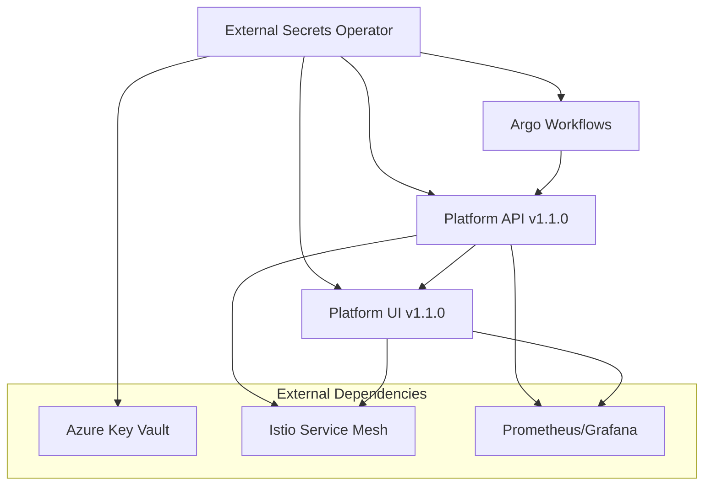

# Platform Engineering Stack - Production Deployment

## Overview

This directory contains production-ready Kubernetes manifests for deploying a complete **Namespace-as-a-Service platform** to Azure Kubernetes Service (AKS) using GitOps patterns.

## 🏗️ Architecture

The platform consists of four core components deployed in dependency order:



## 📁 Component Structure

### 🔐 **External Secrets Operator** (`external-secrets/`)

- **Purpose**: Secure secret management with Azure Key Vault integration
- **Features**: Automatic secret rotation, multi-namespace support, disaster recovery
- **Dependencies**: Azure Key Vault, Workload Identity

### 🔄 **Argo Workflows** (`argo/`)

- **Purpose**: Kubernetes-native workflow engine for namespace provisioning
- **Features**: Platform API integration, RBAC, monitoring, template management
- **Dependencies**: External Secrets (for Azure authentication)

### 🚀 **Platform API** (`platform-api/`)

- **Purpose**: RESTful API for namespace-as-a-service operations
- **Features**: ArgoWorkflows integration, Kubernetes API access, comprehensive monitoring
- **Dependencies**: External Secrets, Argo Workflows, Istio

### 🎨 **Platform UI** (`platform-ui/`)

- **Purpose**: Developer portal for self-service namespace management
- **Features**: Azure AD authentication, real-time updates, responsive design
- **Dependencies**: Platform API, External Secrets, Istio

## 🔧 Production Features

### Security & Compliance

- ✅ **Zero Trust Architecture**: All inter-service communication via Istio mTLS
- ✅ **Secret Management**: Azure Key Vault integration with External Secrets
- ✅ **RBAC**: Least-privilege access patterns across all components
- ✅ **Pod Security**: Non-root containers, read-only filesystems, dropped capabilities
- ✅ **Network Policies**: Traffic segmentation and ingress/egress control

### High Availability & Scalability

- ✅ **Multi-Replica Deployments**: 2-3 replicas minimum for all components
- ✅ **Horizontal Pod Autoscaling**: CPU/memory-based scaling (3-10 replicas)
- ✅ **Pod Disruption Budgets**: Availability during cluster operations
- ✅ **Anti-Affinity Rules**: Pod distribution across availability zones
- ✅ **Health Checks**: Comprehensive liveness, readiness, and startup probes

### Observability & Monitoring

- ✅ **Prometheus Metrics**: Complete telemetry collection for all components
- ✅ **Grafana Dashboards**: Real-time visualizations with SLI/SLO tracking
- ✅ **Alerting Rules**: 20+ critical alerts for operational issues
- ✅ **Distributed Tracing**: OpenTelemetry-ready with Istio integration
- ✅ **Structured Logging**: JSON logs with correlation IDs

### Service Mesh Integration

- ✅ **Istio Configuration**: VirtualServices, DestinationRules, Gateways
- ✅ **Circuit Breaking**: Fault tolerance and cascading failure prevention
- ✅ **Load Balancing**: Intelligent traffic distribution
- ✅ **Authorization Policies**: Fine-grained access control

## 🚀 Quick Start

### Prerequisites

1. **AKS Cluster** with:
   - Istio service mesh installed
   - Azure Workload Identity enabled
   - Node pools configured for system/user workloads

2. **Azure Resources**:
   - Azure Key Vault with required secrets
   - Azure AD application registrations
   - DNS zones configured

3. **Local Tools**:
   ```bash
   # Install required tools
   brew install kubectl kustomize yq helm flux
   ```

### Deployment Methods

#### Option 1: Direct Deployment (Testing)

```bash
# Validate manifests
./validate-production-stack.sh

# Deploy the stack
kubectl apply -k .

# Watch deployment progress
kubectl get pods -n platform-system -w
```

#### Option 2: GitOps with Flux (Recommended)

```bash
# Configure Flux to watch this directory
flux create source git platform-stack \
  --url=https://github.com/davidmarkgardiner/claude-aso \
  --branch=main \
  --interval=5m

# Create Kustomization
flux create kustomization platform-stack \
  --source=platform-stack \
  --path="./apps" \
  --prune=true \
  --wait=true \
  --interval=10m \
  --retry-interval=2m \
  --health-check-timeout=5m
```

### Post-Deployment Validation

```bash
# Run comprehensive validation
./validate-production-stack.sh

# Check component-specific health
./external-secrets/validate-deployment.sh
./argo/validate-deployment.sh
./platform-api/validate-deployment.sh
./platform-ui/validate-deployment.sh

# Test end-to-end functionality
curl -k https://platform.yourdomain.com/api/health
```

## 🔑 Required Secrets in Azure Key Vault

### External Secrets Configuration

```bash
# External Secrets Operator secrets
az keyvault secret set --vault-name <vault-name> --name external-secrets-client-id --value <client-id>
az keyvault secret set --vault-name <vault-name> --name azure-tenant-id --value <tenant-id>
```

### Platform API Secrets

```bash
# Authentication & Database
az keyvault secret set --vault-name <vault-name> --name jwt-secret --value <random-256-bit-key>
az keyvault secret set --vault-name <vault-name> --name db-host --value <database-host>
az keyvault secret set --vault-name <vault-name> --name db-user --value <database-username>
az keyvault secret set --vault-name <vault-name> --name db-password --value <database-password>

# Azure Integration
az keyvault secret set --vault-name <vault-name> --name azure-client-id --value <api-client-id>
az keyvault secret set --vault-name <vault-name> --name azure-client-secret --value <api-client-secret>
```

### Platform UI Secrets

```bash
# UI Configuration
az keyvault secret set --vault-name <vault-name> --name ui-client-secret --value <ui-client-secret>
az keyvault secret set --vault-name <vault-name> --name session-secret --value <random-session-key>
az keyvault secret set --vault-name <vault-name> --name appinsights-connection-string --value <appinsights-string>
```

### Argo Workflows Secrets

```bash
# Workflow Engine
az keyvault secret set --vault-name <vault-name> --name argo-client-id --value <argo-client-id>
az keyvault secret set --vault-name <vault-name> --name platform-api-jwt-token --value <service-token>
```

## 🌍 Environment Configuration

### Development

- Use `minikube` for local testing
- External Secrets uses development Key Vault
- Reduced resource requirements
- Debug logging enabled

### Staging

- Staging AKS cluster
- Production-like resource allocation
- Staging Key Vault with production-like data
- Enhanced monitoring

### Production

- Production AKS cluster
- Full resource allocation and HA configuration
- Production Key Vault with encrypted secrets
- Complete monitoring and alerting

## 🔍 Monitoring & Alerting

### Key Metrics

- **Availability**: 99.9% uptime SLO
- **Performance**: P95 response time < 500ms
- **Error Rate**: < 0.1% for critical operations
- **Throughput**: 1000+ namespace operations/hour

### Critical Alerts

- Pod crash loops or restarts
- High memory/CPU utilization (>80%)
- External Secrets sync failures
- Workflow execution failures
- API response time degradation
- TLS certificate expiration

### Dashboards

- **Platform Overview**: Health, performance, usage
- **Namespace Operations**: Provisioning success rate, time-to-ready
- **Security**: Authentication, authorization, policy violations
- **Infrastructure**: Resource utilization, costs, scaling

## 🛠️ Troubleshooting

### Common Issues

#### External Secrets Not Syncing

```bash
# Check External Secrets Operator
kubectl logs -n external-secrets-system deployment/external-secrets
kubectl get externalsecrets -A
kubectl describe externalsecret platform-api-secrets -n platform-system

# Verify Azure Key Vault access
kubectl get clustersecretstore azure-keyvault-prod -o yaml
```

#### Argo Workflows Not Starting

```bash
# Check workflow controller
kubectl logs -n argo deployment/workflow-controller
kubectl get workflows -A

# Verify RBAC permissions
kubectl auth can-i create workflows --as=system:serviceaccount:platform-system:platform-api -n argo
```

#### Platform API Connection Issues

```bash
# Check API health
kubectl exec -n platform-system deployment/platform-api -- curl localhost:3000/health

# Verify Kubernetes API access
kubectl logs -n platform-system deployment/platform-api | grep -i kubernetes

# Test Argo Workflows integration
kubectl exec -n platform-system deployment/platform-api -- curl -X POST localhost:3000/api/test-workflow
```

#### Platform UI Not Loading

```bash
# Check nginx configuration
kubectl logs -n platform-system deployment/platform-ui
kubectl exec -n platform-system deployment/platform-ui -- nginx -t

# Verify API connectivity
kubectl exec -n platform-system deployment/platform-ui -- curl http://platform-api:3000/health
```

### Support & Documentation

- **Component Documentation**: Each component directory contains detailed README.md
- **API Documentation**: Available at `/api/docs` endpoint
- **Runbooks**: Located in each component's directory
- **Monitoring**: Grafana dashboards with troubleshooting links

## 📈 Scaling & Performance

### Resource Planning

#### Small Environment (< 100 namespaces)

- Platform API: 2 replicas, 256Mi memory, 100m CPU
- Platform UI: 2 replicas, 128Mi memory, 50m CPU
- Argo: 1 controller, 512Mi memory, 200m CPU

#### Medium Environment (100-1000 namespaces)

- Platform API: 3-5 replicas, 512Mi memory, 200m CPU
- Platform UI: 3 replicas, 256Mi memory, 100m CPU
- Argo: 2 controllers, 1Gi memory, 500m CPU

#### Large Environment (1000+ namespaces)

- Platform API: 5-10 replicas, 1Gi memory, 500m CPU
- Platform UI: 5 replicas, 512Mi memory, 200m CPU
- Argo: 3 controllers, 2Gi memory, 1 CPU

### Performance Tuning

1. **Database Optimization**: Connection pooling, query optimization, read replicas
2. **Kubernetes API**: Increase rate limits, optimize list operations
3. **Caching**: Redis for session data, API response caching
4. **CDN**: Static asset delivery optimization

## 🚢 Version Management

### Current Version: v1.1.0

**Features:**

- ✅ Kubernetes API-based Argo Workflows integration
- ✅ External Secrets Operator with Azure Key Vault
- ✅ Complete Istio service mesh integration
- ✅ Comprehensive monitoring and alerting
- ✅ Production-ready security configurations

**Image Tags:**

- `davidgardiner/platform-api:v1.1.0`
- `davidgardiner/platform-ui:v1.1.0`

**Upgrading:**

```bash
# Update image tags in kustomization.yaml
kustomize edit set image davidgardiner/platform-api:v1.1.1
kustomize edit set image davidgardiner/platform-ui:v1.1.1

# Apply updates
kubectl apply -k .

# Monitor rollout
kubectl rollout status deployment/platform-api -n platform-system
```

## 🤝 Contributing

1. **Feature Development**: Create feature branches from `main`
2. **Testing**: Test in minikube before AKS deployment
3. **Documentation**: Update component READMEs and this guide
4. **Validation**: Run `./validate-production-stack.sh` before commits
5. **Security**: Scan for secrets with `./scripts/scan-secrets.sh`

## 📞 Support

- **Issues**: GitHub Issues with component labels
- **Documentation**: Component-specific README files
- **Monitoring**: Grafana dashboards and alerts
- **Logs**: Centralized logging with structured JSON format
