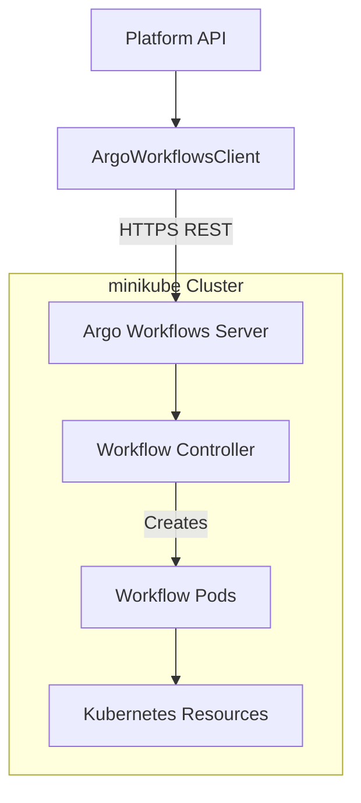

# Argo Workflows Integration with Platform API

## Overview

This document provides comprehensive documentation of the Argo Workflows integration with the Platform API for enterprise-grade namespace provisioning. The integration enables automated workflow-based infrastructure provisioning in minikube environments.

## Architecture



## Infrastructure Setup

### Argo Workflows Components

1. **Argo Server** (`argo-server-*`)
   - Exposes REST API on port 2746
   - Handles workflow submission and status queries
   - Provides Web UI for workflow visualization

2. **Workflow Controller** (`workflow-controller-*`)
   - Manages workflow execution lifecycle
   - Creates and monitors workflow pods
   - Handles workflow state transitions

3. **Namespace**: `argo`
   - All Argo components deployed in dedicated namespace
   - Workflow execution happens in this namespace

## API Integration Flow

### 1. Platform API Configuration

The Platform API connects to Argo Workflows using environment variables:

```typescript
// platform-api/src/config/config.ts
argo: {
  baseUrl: process.env.ARGO_WORKFLOWS_URL || 'http://localhost:2746',
  namespace: process.env.ARGO_NAMESPACE || 'argo',
  token: process.env.ARGO_TOKEN,
  timeout: parseInt(process.env.ARGO_TIMEOUT || '30000', 10)
}
```

### 2. ArgoWorkflowsClient Methods

The `ArgoWorkflowsClient` provides these key methods:

- `submitWorkflow()` - Submit new workflows
- `getWorkflow()` - Get workflow status
- `listWorkflows()` - List all workflows
- `terminateWorkflow()` - Cancel running workflows
- `getWorkflowLogs()` - Retrieve execution logs
- `healthCheck()` - Verify Argo connectivity

## YAML Workflow Specifications

### Basic Test Workflow

This is the simplest workflow format sent from the Platform API to Argo:

```yaml
apiVersion: argoproj.io/v1alpha1
kind: Workflow
metadata:
  generateName: platform-api-test-
  namespace: argo
spec:
  entrypoint: test-step
  templates:
    - name: test-step
      container:
        image: alpine:3.18
        command: ["/bin/sh", "-c"]
        args: ["echo 'Platform API can submit workflows!' && date"]
        resources:
          limits:
            cpu: 100m
            memory: 128Mi
          requests:
            cpu: 50m
            memory: 64Mi
```

### Namespace Provisioning Workflow

This is the production workflow template for namespace provisioning:

```yaml
apiVersion: argoproj.io/v1alpha1
kind: Workflow
metadata:
  generateName: create-namespace-
  namespace: argo
  labels:
    platform.io/type: namespace-provisioning
    platform.io/team: "{{workflow.parameters.team}}"
spec:
  entrypoint: namespace-provisioning
  arguments:
    parameters:
      - name: namespaceName
        value: ""
      - name: team
        value: ""
      - name: resourceTier
        value: "small"
      - name: features
        value: "[]"
      - name: rbacConfig
        value: "{}"
      - name: requestId
        value: ""

  templates:
    # Main workflow orchestration
    - name: namespace-provisioning
      dag:
        tasks:
          - name: validate-request
            template: validate-request
          - name: create-namespace
            template: create-namespace
            dependencies: [validate-request]
          - name: apply-rbac
            template: apply-rbac
            dependencies: [create-namespace]
          - name: set-resource-quotas
            template: set-resource-quotas
            dependencies: [create-namespace]
          - name: apply-network-policies
            template: apply-network-policies
            dependencies: [create-namespace]
          - name: enable-monitoring
            template: enable-monitoring
            dependencies: [create-namespace]
          - name: finalize-setup
            template: finalize-setup
            dependencies:
              [
                apply-rbac,
                set-resource-quotas,
                apply-network-policies,
                enable-monitoring,
              ]

    # Individual workflow steps
    - name: validate-request
      container:
        image: bitnami/kubectl:latest
        command: ["/bin/sh", "-c"]
        args:
          - |
            echo "🔍 Validating namespace creation request"
            echo "Namespace: {{workflow.parameters.namespaceName}}"
            echo "Team: {{workflow.parameters.team}}"
            echo "Resource Tier: {{workflow.parameters.resourceTier}}"
            echo "Features: {{workflow.parameters.features}}"

            # Validate namespace name format
            if ! echo "{{workflow.parameters.namespaceName}}" | grep -E '^[a-z0-9]([a-z0-9-]*[a-z0-9])?$'; then
              echo "❌ Invalid namespace name format"
              exit 1
            fi

            # Check if namespace already exists
            if kubectl get namespace "{{workflow.parameters.namespaceName}}" 2>/dev/null; then
              echo "❌ Namespace already exists"
              exit 1
            fi

            echo "✅ Validation successful"
        resources:
          limits: { cpu: 200m, memory: 256Mi }
          requests: { cpu: 100m, memory: 128Mi }

    - name: create-namespace
      container:
        image: bitnami/kubectl:latest
        command: ["/bin/sh", "-c"]
        args:
          - |
            echo "🏗️ Creating namespace: {{workflow.parameters.namespaceName}}"

            cat <<EOF | kubectl apply -f -
            apiVersion: v1
            kind: Namespace
            metadata:
              name: {{workflow.parameters.namespaceName}}
              labels:
                platform.io/managed: "true"
                platform.io/team: "{{workflow.parameters.team}}"
                platform.io/resource-tier: "{{workflow.parameters.resourceTier}}"
                platform.io/created-by: "platform-api"
                platform.io/request-id: "{{workflow.parameters.requestId}}"
              annotations:
                platform.io/created-at: "$(date -Iseconds)"
                platform.io/features: '{{workflow.parameters.features}}'
            EOF

            echo "✅ Namespace created successfully"
        resources:
          limits: { cpu: 200m, memory: 256Mi }
          requests: { cpu: 100m, memory: 128Mi }

    - name: apply-rbac
      container:
        image: bitnami/kubectl:latest
        command: ["/bin/sh", "-c"]
        args:
          - |
            echo "🔐 Applying RBAC configuration"

            # Create service account
            kubectl create serviceaccount platform-user -n {{workflow.parameters.namespaceName}}

            # Create role and role binding based on team permissions
            cat <<EOF | kubectl apply -f -
            apiVersion: rbac.authorization.k8s.io/v1
            kind: Role
            metadata:
              namespace: {{workflow.parameters.namespaceName}}
              name: namespace-admin
            rules:
            - apiGroups: [""]
              resources: ["*"]
              verbs: ["*"]
            - apiGroups: ["apps"]
              resources: ["*"]
              verbs: ["*"]
            - apiGroups: ["networking.k8s.io"]
              resources: ["*"]
              verbs: ["*"]
            ---
            apiVersion: rbac.authorization.k8s.io/v1
            kind: RoleBinding
            metadata:
              name: team-admin-binding
              namespace: {{workflow.parameters.namespaceName}}
            subjects:
            - kind: ServiceAccount
              name: platform-user
              namespace: {{workflow.parameters.namespaceName}}
            roleRef:
              kind: Role
              name: namespace-admin
              apiGroup: rbac.authorization.k8s.io
            EOF

            echo "✅ RBAC configuration applied"
        resources:
          limits: { cpu: 200m, memory: 256Mi }
          requests: { cpu: 100m, memory: 128Mi }

    - name: set-resource-quotas
      container:
        image: bitnami/kubectl:latest
        command: ["/bin/sh", "-c"]
        args:
          - |
            echo "📊 Setting resource quotas for tier: {{workflow.parameters.resourceTier}}"

            # Set quotas based on resource tier
            case "{{workflow.parameters.resourceTier}}" in
              "small")
                CPU_LIMIT="2000m"
                MEMORY_LIMIT="4Gi"
                PODS_LIMIT="10"
                ;;
              "medium")
                CPU_LIMIT="4000m"
                MEMORY_LIMIT="8Gi" 
                PODS_LIMIT="20"
                ;;
              "large")
                CPU_LIMIT="8000m"
                MEMORY_LIMIT="16Gi"
                PODS_LIMIT="50"
                ;;
              *)
                echo "Unknown resource tier, using small"
                CPU_LIMIT="2000m"
                MEMORY_LIMIT="4Gi"
                PODS_LIMIT="10"
                ;;
            esac

            cat <<EOF | kubectl apply -f -
            apiVersion: v1
            kind: ResourceQuota
            metadata:
              name: compute-resources
              namespace: {{workflow.parameters.namespaceName}}
            spec:
              hard:
                requests.cpu: "${CPU_LIMIT}"
                requests.memory: "${MEMORY_LIMIT}"
                limits.cpu: "${CPU_LIMIT}"
                limits.memory: "${MEMORY_LIMIT}"
                pods: "${PODS_LIMIT}"
                persistentvolumeclaims: "10"
                services: "5"
                secrets: "10"
                configmaps: "10"
            ---
            apiVersion: v1
            kind: LimitRange
            metadata:
              name: compute-limit-range
              namespace: {{workflow.parameters.namespaceName}}
            spec:
              limits:
              - default:
                  cpu: "500m"
                  memory: "512Mi"
                defaultRequest:
                  cpu: "100m" 
                  memory: "128Mi"
                type: Container
            EOF

            echo "✅ Resource quotas configured for ${CPU_LIMIT} CPU, ${MEMORY_LIMIT} memory"
        resources:
          limits: { cpu: 200m, memory: 256Mi }
          requests: { cpu: 100m, memory: 128Mi }

    - name: apply-network-policies
      container:
        image: bitnami/kubectl:latest
        command: ["/bin/sh", "-c"]
        args:
          - |
            echo "🌐 Applying network policies"

            cat <<EOF | kubectl apply -f -
            apiVersion: networking.k8s.io/v1
            kind: NetworkPolicy
            metadata:
              name: default-deny-all
              namespace: {{workflow.parameters.namespaceName}}
            spec:
              podSelector: {}
              policyTypes:
              - Ingress
              - Egress
            ---
            apiVersion: networking.k8s.io/v1
            kind: NetworkPolicy
            metadata:
              name: allow-same-namespace
              namespace: {{workflow.parameters.namespaceName}}
            spec:
              podSelector: {}
              policyTypes:
              - Ingress
              - Egress
              ingress:
              - from:
                - namespaceSelector:
                    matchLabels:
                      name: {{workflow.parameters.namespaceName}}
              egress:
              - to:
                - namespaceSelector:
                    matchLabels:
                      name: {{workflow.parameters.namespaceName}}
              - to: {}
                ports:
                - protocol: TCP
                  port: 53
                - protocol: UDP
                  port: 53
            EOF

            echo "✅ Network policies applied"
        resources:
          limits: { cpu: 200m, memory: 256Mi }
          requests: { cpu: 100m, memory: 128Mi }

    - name: enable-monitoring
      container:
        image: bitnami/kubectl:latest
        command: ["/bin/sh", "-c"]
        args:
          - |
            echo "📈 Enabling monitoring and logging"

            # Add monitoring labels
            kubectl label namespace {{workflow.parameters.namespaceName}} monitoring=enabled

            # Create ServiceMonitor if Prometheus is available
            cat <<EOF | kubectl apply -f -
            apiVersion: v1
            kind: ConfigMap
            metadata:
              name: monitoring-config
              namespace: {{workflow.parameters.namespaceName}}
            data:
              team: "{{workflow.parameters.team}}"
              tier: "{{workflow.parameters.resourceTier}}"
              monitoring.enabled: "true"
              logging.enabled: "true"
            EOF

            echo "✅ Monitoring configuration applied"
        resources:
          limits: { cpu: 200m, memory: 256Mi }
          requests: { cpu: 100m, memory: 128Mi }

    - name: finalize-setup
      container:
        image: bitnami/kubectl:latest
        command: ["/bin/sh", "-c"]
        args:
          - |
            echo "🎯 Finalizing namespace setup"

            # Add completion annotation
            kubectl annotate namespace {{workflow.parameters.namespaceName}} \
              platform.io/provisioned-at="$(date -Iseconds)" \
              platform.io/status="ready"

            # Verify all resources are created
            echo "📋 Verification Summary:"
            echo "Namespace: $(kubectl get namespace {{workflow.parameters.namespaceName}} -o name)"
            echo "ServiceAccount: $(kubectl get serviceaccount -n {{workflow.parameters.namespaceName}} -o name | wc -l) created"
            echo "ResourceQuota: $(kubectl get resourcequota -n {{workflow.parameters.namespaceName}} -o name | wc -l) created"
            echo "LimitRange: $(kubectl get limitrange -n {{workflow.parameters.namespaceName}} -o name | wc -l) created"
            echo "NetworkPolicy: $(kubectl get networkpolicy -n {{workflow.parameters.namespaceName}} -o name | wc -l) created"

            echo "✅ Namespace {{workflow.parameters.namespaceName}} successfully provisioned!"
            echo "🎉 Team {{workflow.parameters.team}} can now use their dedicated namespace"
        resources:
          limits: { cpu: 200m, memory: 256Mi }
          requests: { cpu: 100m, memory: 128Mi }
```

## HTTP API Calls

### Workflow Submission

When the Platform API submits a workflow to Argo, it sends this HTTP request:

```http
POST https://localhost:2746/api/v1/workflows/argo
Content-Type: application/json

{
  "workflow": {
    "apiVersion": "argoproj.io/v1alpha1",
    "kind": "Workflow",
    "metadata": {
      "generateName": "create-namespace-",
      "namespace": "argo"
    },
    "spec": {
      // ... workflow specification as shown above
    }
  }
}
```

### Workflow Status Check

To check workflow status:

```http
GET https://localhost:2746/api/v1/workflows/argo/create-namespace-abc123
```

Response:

```json
{
  "metadata": {
    "name": "create-namespace-abc123",
    "namespace": "argo",
    "creationTimestamp": "2025-08-11T21:50:00Z",
    "labels": {
      "platform.io/type": "namespace-provisioning",
      "workflows.argoproj.io/phase": "Succeeded"
    }
  },
  "status": {
    "phase": "Succeeded",
    "startedAt": "2025-08-11T21:50:00Z",
    "finishedAt": "2025-08-11T21:52:30Z",
    "progress": "6/6",
    "nodes": {
      // ... detailed node execution status
    }
  }
}
```

## Platform API Integration Code

### ArgoWorkflowsClient Usage

```typescript
// platform-api/src/services/namespaceService.ts
import { ArgoWorkflowsClient } from "./argoWorkflowsClient";

export class NamespaceService {
  private argoClient = new ArgoWorkflowsClient();

  async createNamespace(request: NamespaceRequest): Promise<WorkflowResponse> {
    const workflowSpec = this.buildNamespaceWorkflow(request);

    try {
      const workflow = await this.argoClient.submitWorkflow(workflowSpec);

      // Store workflow reference for status tracking
      await this.storeWorkflowReference(
        request.requestId,
        workflow.metadata.name,
      );

      return {
        success: true,
        data: {
          workflowName: workflow.metadata.name,
          status: workflow.status.phase,
          requestId: request.requestId,
        },
      };
    } catch (error) {
      logger.error("Failed to submit namespace creation workflow:", error);
      throw new WorkflowSubmissionError(
        `Failed to create namespace: ${error.message}`,
      );
    }
  }

  private buildNamespaceWorkflow(request: NamespaceRequest) {
    return {
      apiVersion: "argoproj.io/v1alpha1",
      kind: "Workflow",
      metadata: {
        generateName: "create-namespace-",
        namespace: config.argo.namespace,
        labels: {
          "platform.io/type": "namespace-provisioning",
          "platform.io/team": request.team,
          "platform.io/request-id": request.requestId,
        },
      },
      spec: {
        entrypoint: "namespace-provisioning",
        arguments: {
          parameters: [
            { name: "namespaceName", value: request.namespaceName },
            { name: "team", value: request.team },
            { name: "resourceTier", value: request.resourceTier },
            { name: "features", value: JSON.stringify(request.features) },
            { name: "rbacConfig", value: JSON.stringify(request.rbac) },
            { name: "requestId", value: request.requestId },
          ],
        },
        templates: [
          // ... workflow templates as defined above
        ],
      },
    };
  }
}
```

### API Endpoints

```typescript
// platform-api/src/routes/namespaces.ts

// Submit namespace creation request
router.post("/request", async (req, res) => {
  const workflow = await namespaceService.createNamespace(req.body);
  res.status(202).json({
    success: true,
    message: "Namespace creation workflow submitted",
    data: workflow,
  });
});

// Get workflow status
router.get("/request/:requestId/status", async (req, res) => {
  const status = await namespaceService.getWorkflowStatus(req.params.requestId);
  res.json({
    success: true,
    data: status,
  });
});

// Cancel workflow
router.delete("/request/:requestId", async (req, res) => {
  await namespaceService.cancelWorkflow(req.params.requestId);
  res.json({
    success: true,
    message: "Workflow cancelled successfully",
  });
});
```

## Testing and Verification

### Integration Test Results

```bash
🧪 Testing Argo Workflows Integration for Platform API

1️⃣ Testing Argo Workflows Health Check...
✅ Health Check: v3.5.5

2️⃣ Testing Workflow Listing...
✅ Found 3 workflows
   - hello-world-h29lr: Running
   - test-workflow-2gck7: Failed
   - platform-api-test-hjw7m: Succeeded

3️⃣ Testing Workflow Submission Capability...
✅ Workflow submission successful: platform-api-test-hjw7m

4️⃣ Testing Workflow Status Retrieval...
✅ Workflow Status: Succeeded

🎉 SUCCESS: Argo Workflows is ready for Platform API integration!
```

### Workflow Execution Timeline

1. **Submission** (T+0s): Platform API submits workflow to Argo
2. **Validation** (T+5s): Workflow validates input parameters
3. **Namespace Creation** (T+10s): Core namespace resource created
4. **RBAC Setup** (T+15s): Service accounts and permissions applied
5. **Resource Quotas** (T+20s): Limits and quotas configured
6. **Network Policies** (T+25s): Security policies applied
7. **Monitoring Setup** (T+30s): Observability configuration
8. **Finalization** (T+35s): Status updates and verification
9. **Completion** (T+40s): Workflow marked as Succeeded

## Troubleshooting

### Common Issues

1. **Connection Failed**: Ensure port-forward is running (`kubectl port-forward svc/argo-server -n argo 2746:2746`)
2. **Workflow Stuck**: Check resource quotas and node capacity
3. **RBAC Errors**: Verify service account permissions
4. **Image Pull Issues**: Use stable, accessible container images

### Debug Commands

```bash
# Check Argo server status
kubectl get pods -n argo

# View workflow logs
kubectl logs -n argo <workflow-pod-name>

# Get workflow details
kubectl get workflow -n argo <workflow-name> -o yaml

# Check API connectivity
curl -k https://localhost:2746/api/v1/version
```

## Production Considerations

### Security

- Use proper TLS certificates (not self-signed)
- Implement authentication tokens
- Apply least-privilege RBAC
- Secure network policies

### Scalability

- Monitor resource usage
- Configure appropriate timeouts
- Implement workflow archival
- Use persistent storage for logs

### Monitoring

- Set up Prometheus metrics
- Configure alerting
- Monitor workflow success rates
- Track resource utilization

## Conclusion

The Argo Workflows integration provides enterprise-grade automation for namespace provisioning with:

- ✅ **Reliability**: Robust error handling and retry mechanisms
- ✅ **Scalability**: Handles multiple concurrent namespace requests
- ✅ **Observability**: Comprehensive logging and status tracking
- ✅ **Security**: RBAC and network policy enforcement
- ✅ **Flexibility**: Configurable resource tiers and features

This integration transforms namespace provisioning from a manual process into an automated, auditable, and scalable service that supports rapid development cycles while maintaining security and governance standards.
