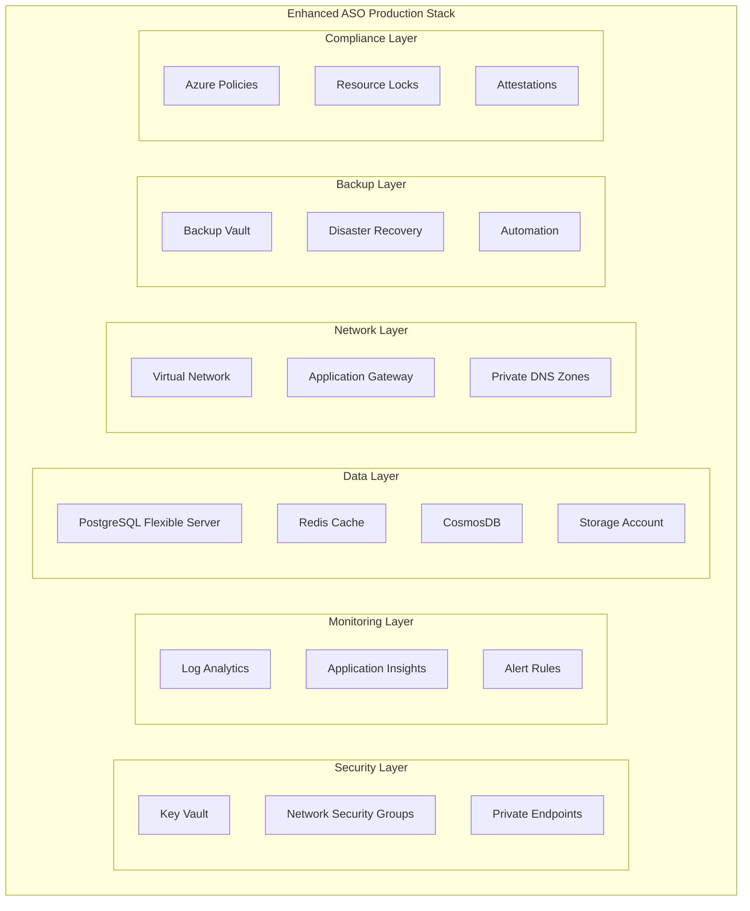

# ASO Production Stack

This directory contains enterprise-grade Azure Service Operator (ASO) configurations for production deployment of AKS infrastructure with comprehensive security, monitoring, backup, and compliance capabilities.

## 🎯 Overview

The ASO Production Stack transforms the basic ASO deployment into a comprehensive enterprise-ready solution with:

- **Enhanced Security**: Key Vault, private endpoints, network security groups
- **Comprehensive Monitoring**: Log Analytics, Application Insights, automated alerting
- **High Availability**: Multi-zone deployment, backup and disaster recovery
- **Compliance**: SOC 2, GDPR, ISO 27001 policy enforcement
- **Performance**: Optimized storage, database services, networking
- **Governance**: Resource locks, budget controls, RBAC

## 📁 Component Overview

### Core Components (Enhanced)

| Component              | Description                    | Key Features                             |
| ---------------------- | ------------------------------ | ---------------------------------------- |
| `keyvault.yaml`        | Centralized secrets management | Private endpoints, RBAC, encryption      |
| `monitoring.yaml`      | Observability stack            | Log Analytics, App Insights, alerts      |
| `storage.yaml`         | Storage and container registry | Private ACR, secure storage, diagnostics |
| `networking.yaml`      | Enhanced networking            | VNet, NSG, Application Gateway, WAF      |
| `database.yaml`        | Managed database services      | PostgreSQL, Redis, CosmosDB with HA      |
| `backup-recovery.yaml` | Backup and DR solutions        | Recovery vault, automation, cross-region |
| `compliance.yaml`      | Governance and compliance      | Azure Policy, locks, attestations        |

### Architecture Enhancements



## 🚀 Deployment

### Prerequisites

1. **Azure Service Operator v2.14.0+** installed on the cluster
2. **Sufficient Azure permissions** for resource creation
3. **Existing basic ASO stack** from `../aso-stack/`

### Quick Deploy

```bash
# Deploy the entire production stack
kubectl apply -k aso-production-stack/

# Monitor deployment
kubectl get managedcluster,vault,loganalyticsworkspace -n azure-system -w

# Verify components
kubectl get pods -n azure-system
```

### Gradual Deployment (Recommended)

Deploy components in phases for easier troubleshooting:

```bash
# Phase 1: Security and Monitoring
kubectl apply -f aso-production-stack/keyvault.yaml
kubectl apply -f aso-production-stack/monitoring.yaml

# Wait and verify
kubectl get vault,workspace -n azure-system

# Phase 2: Storage and Networking
kubectl apply -f aso-production-stack/storage.yaml
kubectl apply -f aso-production-stack/networking.yaml

# Phase 3: Database and Backup
kubectl apply -f aso-production-stack/database.yaml
kubectl apply -f aso-production-stack/backup-recovery.yaml

# Phase 4: Compliance
kubectl apply -f aso-production-stack/compliance.yaml
```

## 🔒 Security Features

### Key Vault Integration

- **Centralized secrets management** with RBAC
- **Private endpoint connectivity**
- **Customer-managed encryption keys**
- **Automatic secret rotation** support

### Network Security

- **Private Virtual Network** with custom subnets
- **Network Security Groups** with restrictive rules
- **Application Gateway with WAF** (OWASP 3.2)
- **Private endpoints** for all Azure services

### Identity & Access

- **Workload Identity** for all service accounts
- **Least privilege RBAC** assignments
- **Multi-factor authentication** requirements
- **Azure AD integration** for database access

## 📊 Monitoring & Observability

### Log Analytics Workspace

- **Centralized logging** for all components
- **30-day retention** (configurable)
- **Cost-optimized** with daily quotas

### Application Insights

- **Application performance monitoring**
- **90-day data retention**
- **Custom telemetry** support

### Automated Alerting

- **Cluster health** monitoring
- **Performance thresholds** (CPU >80%, Memory >85%)
- **Pod restart** detection
- **Security violations** alerts

## 💾 Data Services

### PostgreSQL Flexible Server

- **Zone-redundant high availability**
- **35-day backup retention**
- **Customer-managed encryption**
- **Private connectivity only**

### Redis Cache Premium

- **VNet integration**
- **Clustering support**
- **Daily backups**
- **SSL/TLS enforcement**

### Storage Services

- **Private Container Registry** (Premium tier)
- **Secure Storage Account** (Standard LRS)
- **File shares** for persistent volumes
- **Geo-redundant backups**

## 🔄 Backup & Disaster Recovery

### Recovery Services Vault

- **Daily VM backups** with 7-year retention
- **File share backups** with monthly archiving
- **Cross-region restore** capability
- **Immutable backup** protection

### Automation

- **Automated backup verification**
- **Daily integrity checks**
- **Alert on failures**
- **Compliance reporting**

## 📋 Compliance & Governance

### Policy Enforcement

- **SOC 2 Type II** controls
- **GDPR** data protection
- **ISO 27001** security standards
- **Custom AKS security** requirements

### Resource Protection

- **Resource locks** on critical components
- **Data classification** tagging requirements
- **Cost budgets** with alerting
- **Compliance attestations**

## 💰 Cost Optimization

### Estimated Monthly Costs (UK South)

| Component            | Monthly Cost   | Notes                   |
| -------------------- | -------------- | ----------------------- |
| Key Vault            | £5-15          | Standard tier           |
| Log Analytics        | £50-200        | 2GB daily quota         |
| Application Insights | £20-100        | Based on telemetry      |
| PostgreSQL           | £100-500       | General Purpose, 2 vCPU |
| Redis Cache          | £150-300       | Premium P1              |
| Storage Account      | £10-50         | Standard LRS            |
| Container Registry   | £15-50         | Premium tier            |
| Application Gateway  | £150-300       | WAF v2                  |
| Backup Vault         | £50-200        | Based on protected data |
| **Total Estimate**   | **£550-1,715** | Varies by usage         |

### Cost Controls

- **Resource quotas** and limits
- **Budget alerts** at 80% and 100%
- **Automated scaling** policies
- **Lifecycle management** for storage

## 🔧 Configuration

### Environment-Specific Values

Update the following values in each YAML file for your environment:

```yaml
# Subscription ID (replace in all files)
subscriptions/133d5755-4074-4d6e-ad38-eb2a6ad12903

# Resource Group name
at39473-weu-dev-prod

# Region
uksouth

# DNS Zone
davidmarkgardiner.co.uk

# Email addresses
devops@davidmarkgardiner.co.uk
```

### Customization Options

1. **Storage tiers**: Adjust from Standard to Premium for performance
2. **Database sizes**: Scale PostgreSQL and Redis based on requirements
3. **Backup retention**: Modify retention periods for compliance needs
4. **Alert thresholds**: Adjust CPU, memory, and cost alert levels
5. **Network ranges**: Customize VNet CIDR blocks for your network

## 🎯 Production Readiness Checklist

### ✅ Security

- [x] Key Vault with private endpoints
- [x] Network security groups with restrictive rules
- [x] WAF enabled on Application Gateway
- [x] Private endpoints for all services
- [x] Customer-managed encryption keys

### ✅ High Availability

- [x] Zone-redundant PostgreSQL deployment
- [x] Multi-zone AKS node pools
- [x] Cross-region backup and recovery
- [x] Application Gateway in multiple zones
- [x] Redis clustering enabled

### ✅ Monitoring

- [x] Centralized logging in Log Analytics
- [x] Application performance monitoring
- [x] Critical alerts configured
- [x] Dashboard and workbooks
- [x] Diagnostic settings enabled

### ✅ Backup & DR

- [x] Automated daily backups
- [x] Cross-region recovery vault
- [x] Backup verification automation
- [x] Disaster recovery testing plan
- [x] 7-year retention for compliance

### ✅ Compliance

- [x] SOC 2, GDPR, ISO 27001 policies
- [x] Data classification enforcement
- [x] Resource protection locks
- [x] Audit trail logging
- [x] Compliance reporting

## 🚨 Important Notes

### Pre-Deployment Checklist

1. **Review all resource names** and ensure they're unique
2. **Update email addresses** in alert configurations
3. **Set appropriate IP ranges** for network access
4. **Configure DNS delegation** for private zones
5. **Verify subscription quotas** for all services

### Post-Deployment Tasks

1. **Test backup and restore** procedures
2. **Verify monitoring alerts** are working
3. **Configure application secrets** in Key Vault
4. **Set up disaster recovery** runbooks
5. **Conduct security assessment**

### Operational Procedures

1. **Monthly backup verification**
2. **Quarterly disaster recovery testing**
3. **Weekly compliance reporting**
4. **Daily monitoring review**
5. **Annual security audit**

## 📞 Support & Troubleshooting

### Common Issues

1. **ASO Resource Reconciliation Failures**

   ```bash
   kubectl describe <resource-type> <resource-name> -n azure-system
   kubectl logs -n azureserviceoperator-system deployment/azureserviceoperator-controller-manager
   ```

2. **Key Vault Access Issues**
   - Verify managed identity permissions
   - Check network access rules
   - Validate private endpoint configuration

3. **Database Connection Problems**
   - Confirm private DNS zone linking
   - Verify subnet delegation
   - Check firewall rules

### Useful Commands

```bash
# Check ASO operator status
kubectl get pods -n azureserviceoperator-system

# View resource status
kubectl get managedcluster,vault,workspace -n azure-system -o wide

# Check ASO custom resources
kubectl api-resources | grep azure

# Monitor deployment progress
watch kubectl get events -n azure-system --sort-by=.firstTimestamp

# Debug resource issues
kubectl describe <resource-type> <resource-name> -n azure-system
```

### Documentation Links

- [Azure Service Operator Documentation](https://azure.github.io/azure-service-operator/)
- [AKS Best Practices](https://docs.microsoft.com/en-us/azure/aks/best-practices)
- [Azure Security Baseline](https://docs.microsoft.com/en-us/security/benchmark/azure/)
- [Compliance Frameworks](https://docs.microsoft.com/en-us/azure/governance/policy/)

---

This production stack provides enterprise-grade infrastructure foundation for running critical workloads on Azure with comprehensive security, monitoring, and compliance capabilities.
