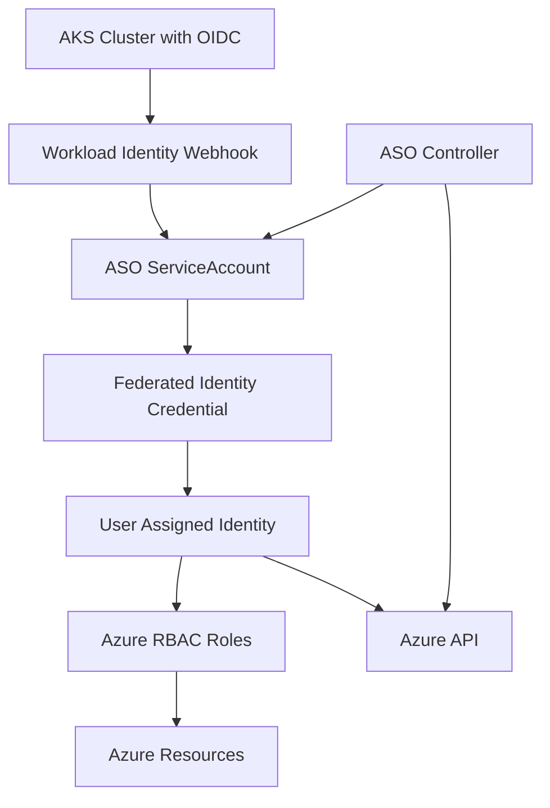

# ASO Workload Identity Implementation Guide

This document provides a comprehensive guide for implementing Azure Workload Identity authentication for Azure Service Operator (ASO) using ASO CRDs rather than CLI commands.

## Overview

This implementation eliminates the need for stored secrets by using Azure Workload Identity, which provides automatic token management through federated identity credentials and OIDC trust relationships.

## Architecture



## Components

### 1. **UserAssignedIdentity** - Creates the Azure managed identity

### 2. **FederatedIdentityCredential** - Establishes OIDC trust relationship

### 3. **RoleAssignment** - Grants necessary Azure permissions

### 4. **ASO Deployment** - Configures ASO with workload identity

## Prerequisites

- AKS cluster with OIDC issuer enabled ✅ (already configured)
- Workload Identity enabled ✅ (already configured)
- Azure Service Operator CRDs installed
- Proper RBAC permissions for ASO to create Azure resources

## Deployment Methods

### Method 1: Automated Deployment (Recommended)

Use the provided deployment script:

```bash
# Make sure you're in the aso-stack directory
cd aso-stack

# Run the deployment script
./deploy-aso-workload-identity.sh
```

### Method 2: Manual Deployment

Apply the Kustomization manually:

```bash
# Deploy all ASO workload identity resources
kubectl apply -k aso-stack/

# Monitor the deployment
kubectl get userassignedidentity,federatedidentitycredential,roleassignment -n azure-system
```

## Resource Configuration Details

### 1. UserAssignedIdentity for ASO

```yaml
apiVersion: managedidentity.azure.com/v1api20230131
kind: UserAssignedIdentity
metadata:
  name: aso-workload-identity
  namespace: azure-system
spec:
  azureName: aso-workload-identity
  location: uksouth
  owner:
    name: at39473-weu-dev-prod # ResourceGroup reference
  operatorSpec:
    configMaps:
      clientId:
        name: aso-identity-cm
        key: clientId
      principalId:
        name: aso-identity-cm
        key: principalId
      tenantId:
        name: aso-identity-cm
        key: tenantId
```

### 2. FederatedIdentityCredential for OIDC Trust

```yaml
apiVersion: managedidentity.azure.com/v1api20230131
kind: FederatedIdentityCredential
metadata:
  name: aso-fic-workload-identity
  namespace: azure-system
spec:
  azureName: aso-workload-identity-fic
  owner:
    name: aso-workload-identity
  audiences:
    - api://AzureADTokenExchange
  issuerFromConfig:
    name: aks-oidc-config-prod # OIDC issuer URL from cluster ConfigMap
    key: issuer-url
  subject: system:serviceaccount:azureserviceoperator-system:azureserviceoperator-default
```

### 3. RoleAssignments for Azure Permissions

ASO requires two key roles:

#### Contributor Role (for resource management)

```yaml
apiVersion: authorization.azure.com/v1api20220401
kind: RoleAssignment
metadata:
  name: aso-subscription-contributor
  namespace: azure-system
spec:
  scope: /subscriptions/133d5755-4074-4d6e-ad38-eb2a6ad12903
  principalIdFromConfig:
    name: aso-identity-cm
    key: principalId
  principalType: ServicePrincipal
  roleDefinitionReference:
    armId: /subscriptions/133d5755-4074-4d6e-ad38-eb2a6ad12903/providers/Microsoft.Authorization/roleDefinitions/b24988ac-6180-42a0-ab88-20f7382dd24c
```

#### User Access Administrator (for RBAC management)

```yaml
apiVersion: authorization.azure.com/v1api20220401
kind: RoleAssignment
metadata:
  name: aso-user-access-administrator
  namespace: azure-system
spec:
  scope: /subscriptions/133d5755-4074-4d6e-ad38-eb2a6ad12903
  principalIdFromConfig:
    name: aso-identity-cm
    key: principalId
  principalType: ServicePrincipal
  roleDefinitionReference:
    armId: /subscriptions/133d5755-4074-4d6e-ad38-eb2a6ad12903/providers/Microsoft.Authorization/roleDefinitions/18d7d88d-d35e-4fb5-a5c3-7773c20a72d9
```

## Verification and Testing

### 1. Check Resource Status

```bash
# Check if identity resources are ready
kubectl get userassignedidentity aso-workload-identity -n azure-system -o jsonpath='{.status.conditions[?(@.type=="Ready")].status}'

# Check federated identity credential
kubectl get federatedidentitycredential aso-fic-workload-identity -n azure-system -o jsonpath='{.status.conditions[?(@.type=="Ready")].status}'

# Check role assignments
kubectl get roleassignment aso-subscription-contributor aso-user-access-administrator -n azure-system
```

### 2. Verify ServiceAccount Configuration

```bash
# Check ServiceAccount annotations
kubectl get serviceaccount azureserviceoperator-default -n azureserviceoperator-system -o yaml

# Check workload identity labels
kubectl get pods -n azureserviceoperator-system -l azure.workload.identity/use=true
```

### 3. Test ASO Functionality

Create a test resource to verify ASO can authenticate and manage Azure resources:

```bash
cat <<EOF | kubectl apply -f -
apiVersion: resources.azure.com/v1api20200601
kind: ResourceGroup
metadata:
  name: aso-test-rg
  namespace: azure-system
spec:
  azureName: aso-workload-identity-test
  location: uksouth
EOF

# Monitor the resource creation
kubectl get resourcegroup aso-test-rg -n azure-system -w
```

## Troubleshooting

### Common Issues

#### 1. Identity Not Ready

**Symptom**: UserAssignedIdentity stuck in "Creating" state
**Solution**:

```bash
# Check ASO controller logs
kubectl logs -n azureserviceoperator-system deployment/azureserviceoperator-controller-manager

# Verify Azure permissions for ASO
kubectl describe userassignedidentity aso-workload-identity -n azure-system
```

#### 2. ServiceAccount Missing Client ID

**Symptom**: ASO pods failing with authentication errors
**Solution**:

```bash
# Check if setup job completed
kubectl get job aso-workload-identity-setup -n azureserviceoperator-system

# Manually set the client ID if needed
CLIENT_ID=$(kubectl get configmap aso-identity-cm -n azure-system -o jsonpath='{.data.clientId}')
kubectl annotate serviceaccount azureserviceoperator-default \
  azure.workload.identity/client-id="$CLIENT_ID" \
  --overwrite=true \
  -n azureserviceoperator-system
```

#### 3. Token Exchange Failures

**Symptom**: "failed to exchange token" errors in ASO logs
**Solution**:

```bash
# Verify OIDC issuer configuration
kubectl get managedcluster uk8s-tsshared-weu-gt025-int-prod -n azure-system -o jsonpath='{.spec.oidcIssuerProfile.enabled}'

# Check federated identity credential subject matches exactly
kubectl get federatedidentitycredential aso-fic-workload-identity -n azure-system -o jsonpath='{.spec.subject}'
```

## Security Considerations

- **No Stored Secrets**: Client secrets are eliminated from Kubernetes
- **Automatic Token Rotation**: Tokens are automatically refreshed by Azure
- **Least Privilege**: Only necessary Azure permissions are granted
- **Audit Trail**: All authentication events are logged in Azure AD

## Rollback Procedure

To rollback to service principal authentication:

```bash
# Remove workload identity resources
kubectl delete -k aso-stack/

# Recreate service principal secret (if needed)
kubectl create secret generic aso-controller-settings \
  --from-literal=AZURE_SUBSCRIPTION_ID="133d5755-4074-4d6e-ad38-eb2a6ad12903" \
  --from-literal=AZURE_TENANT_ID="550cfcda-8a2d-452c-ba71-d6bc6bf5bb31" \
  --from-literal=AZURE_CLIENT_ID="your-sp-client-id" \
  --from-literal=AZURE_CLIENT_SECRET="your-sp-secret" \
  --namespace=azureserviceoperator-system
```

## References

- [Azure Workload Identity Documentation](https://azure.github.io/azure-workload-identity/)
- [ASO Authentication Guide](https://azure.github.io/azure-service-operator/guide/authentication/)
- [AKS Workload Identity](https://docs.microsoft.com/en-us/azure/aks/workload-identity-overview)
