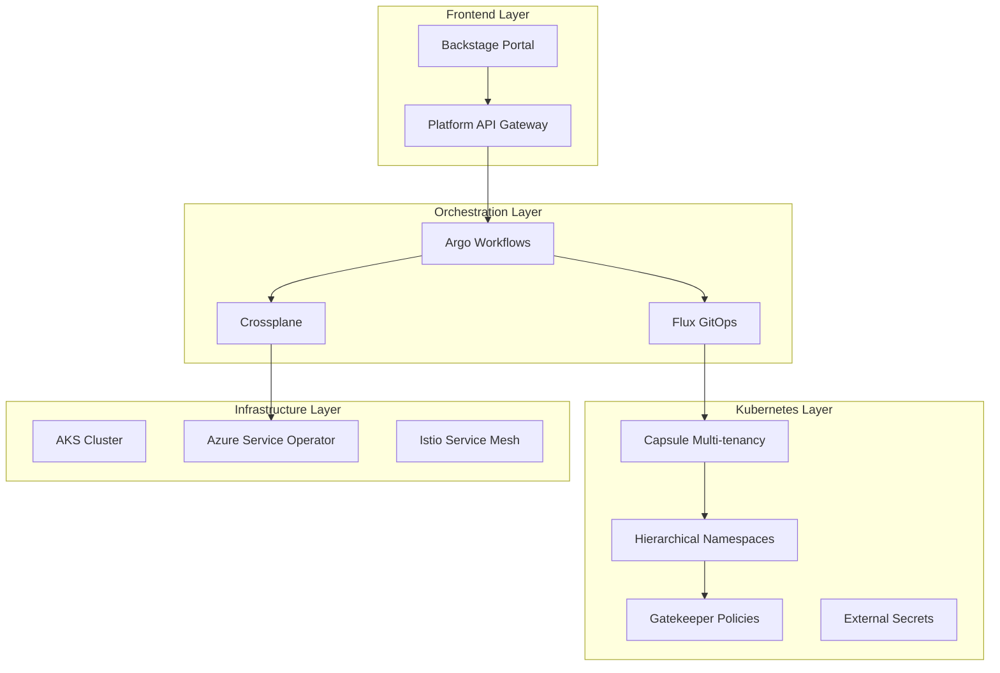

# Namespace-as-a-Service (NaaS) Platform Architecture

## 🎯 Executive Summary

This document provides a comprehensive deep-dive into building a **Developer Cloud Portal** that presents **Namespace-as-a-Service** capabilities, allowing developers to self-serve namespace requests with customized quotas, network policies, alerting, gateways, and domains through a unified platform.

## 📋 Table of Contents

1. [Strategic Overview](#strategic-overview)
2. [Architecture Patterns Analysis](#architecture-patterns-analysis)
3. [Technology Stack Recommendations](#technology-stack-recommendations)
4. [Platform Components](#platform-components)
5. [Multi-Tenancy Patterns](#multi-tenancy-patterns)
6. [Implementation Roadmap](#implementation-roadmap)
7. [Security & Governance](#security--governance)
8. [Cost Management](#cost-management)
9. [Operational Excellence](#operational-excellence)

---

## Strategic Overview

### Current State: Infrastructure-Centric

```
Developer Request → Platform Team → Manual Provisioning → Namespace Ready
```

### Target State: Platform Engineering

```
Developer Self-Service Portal → Automated Provisioning → Instant Namespace + Services
```

### Value Proposition

- **Developer Productivity**: Self-service reduces time-to-environment from days to minutes
- **Platform Team Efficiency**: Automation eliminates manual toil and bottlenecks
- **Standardization**: Consistent security, monitoring, and governance across all environments
- **Cost Optimization**: Automated resource management and chargeback capabilities
- **Scalability**: Platform scales with organization growth without linear team growth

---

## Architecture Patterns Analysis

### 1. Internal Developer Platform (IDP) Pattern ⭐ **RECOMMENDED**

**Description**: Comprehensive platform providing self-service infrastructure capabilities

**Pros**:

- Complete developer experience
- Standardized golden paths
- Integrated workflows
- Strong governance

**Cons**:

- High initial investment
- Complex implementation
- Requires platform team expertise

**Best For**: Organizations with >50 developers, strong platform engineering mandate

### 2. Service Catalog Pattern

**Description**: Marketplace-style interface for requesting pre-defined services

**Pros**:

- Simple to understand
- Quick to implement
- Clear service boundaries

**Cons**:

- Limited flexibility
- Potential catalog sprawl
- Manual approval overhead

**Best For**: Organizations starting their platform journey

### 3. GitOps-First Pattern

**Description**: All provisioning driven through Git repositories and pull requests

**Pros**:

- Complete audit trail
- Familiar developer workflow
- Version controlled infrastructure

**Cons**:

- Git workflow overhead
- Complex for simple requests
- Requires Git proficiency

**Best For**: Teams already heavily invested in GitOps

### 4. Operator-Driven Pattern

**Description**: Custom Kubernetes operators handle provisioning logic

**Pros**:

- Kubernetes-native
- Highly extensible
- Declarative configuration

**Cons**:

- Requires Kubernetes expertise
- Complex troubleshooting
- Limited non-K8s integration

**Best For**: Kubernetes-first organizations with strong operator experience

---

## Technology Stack Recommendations

### 🏆 **Recommended Stack: Hybrid IDP Approach**



### Core Technology Selections

| Component              | Technology                | Justification                                                 |
| ---------------------- | ------------------------- | ------------------------------------------------------------- |
| **Developer Portal**   | Backstage                 | Industry-standard IDP framework, extensible, strong ecosystem |
| **API Gateway**        | Kong/NGINX                | Rate limiting, authentication, analytics for platform APIs    |
| **Workflow Engine**    | Argo Workflows            | Kubernetes-native, handles complex provisioning orchestration |
| **GitOps**             | Flux v2                   | Multi-tenancy support, secure, mature                         |
| **Multi-tenancy**      | Capsule                   | Purpose-built for K8s multi-tenancy, lightweight              |
| **Policy Enforcement** | Gatekeeper                | OPA-based, flexible policy as code                            |
| **Service Mesh**       | Istio                     | Traffic management, security, observability                   |
| **Secrets Management** | External Secrets Operator | Cloud-native secrets integration                              |

### Alternative Stacks by Organization Size

#### **Small Teams (10-50 developers)**

- **Portal**: Port.dev or custom React app
- **Provisioning**: GitHub Actions + Terraform
- **Multi-tenancy**: Basic RBAC + ResourceQuotas
- **Monitoring**: Native K8s metrics

#### **Medium Teams (50-200 developers)**

- **Portal**: Backstage with basic plugins
- **Provisioning**: Argo Workflows + Flux
- **Multi-tenancy**: Capsule
- **Monitoring**: Prometheus + Grafana

#### **Large Teams (200+ developers)**

- **Portal**: Full Backstage with custom plugins
- **Provisioning**: Crossplane + Argo Workflows
- **Multi-tenancy**: Hierarchical Namespaces + Capsule
- **Monitoring**: Full observability stack

---

## Platform Components

### 1. Developer Portal (Backstage)

**Core Features**:

- Service catalog with namespace templates
- Self-service provisioning workflows
- Resource dashboard and monitoring
- Documentation and runbooks
- Team and ownership tracking

**Custom Plugins Needed**:

```typescript
// Namespace Request Plugin
export const namespaceRequestPlugin = createPlugin({
  id: "namespace-request",
  routes: {
    root: rootRouteRef,
    namespaceRequest: namespaceRequestRouteRef,
  },
});

// Resource Monitor Plugin
export const resourceMonitorPlugin = createPlugin({
  id: "resource-monitor",
  routes: {
    root: rootRouteRef,
    dashboard: dashboardRouteRef,
  },
});
```

### 2. Platform API Gateway

**Responsibilities**:

- Authentication and authorization
- Rate limiting per team/user
- Request validation and transformation
- Audit logging
- Metrics collection

**Endpoint Structure**:

```yaml
# Namespace Management
POST /api/v1/namespaces/request
GET /api/v1/namespaces/{namespace}/status
PUT /api/v1/namespaces/{namespace}/quotas
DELETE /api/v1/namespaces/{namespace}

# Service Catalog
GET /api/v1/catalog/templates
GET /api/v1/catalog/templates/{template-id}

# Monitoring & Analytics
GET /api/v1/analytics/usage
GET /api/v1/analytics/costs
```

### 3. Provisioning Engine (Argo Workflows)

**Workflow Types**:

- **Standard Namespace**: Basic namespace with default policies
- **Microservice Namespace**: Enhanced with service mesh, monitoring
- **Data Namespace**: Database access, data policies, compliance
- **ML Namespace**: GPU quotas, ML frameworks, model registry access

**Example Workflow**:

```yaml
apiVersion: argoproj.io/v1alpha1
kind: WorkflowTemplate
metadata:
  name: provision-namespace
spec:
  entrypoint: provision-namespace
  templates:
    - name: provision-namespace
      inputs:
        parameters:
          - name: namespace-name
          - name: team-name
          - name: resource-tier
          - name: network-policy
      dag:
        tasks:
          - name: create-namespace
            template: create-namespace
          - name: apply-quotas
            template: apply-quotas
            depends: create-namespace
          - name: setup-rbac
            template: setup-rbac
            depends: create-namespace
          - name: configure-network-policies
            template: configure-network-policies
            depends: create-namespace
          - name: setup-monitoring
            template: setup-monitoring
            depends: create-namespace
```

### 4. Multi-Tenancy Controller (Capsule)

**Tenant Configuration**:

```yaml
apiVersion: capsule.clastix.io/v1beta2
kind: Tenant
metadata:
  name: team-frontend
spec:
  owners:
    - name: frontend-team
      kind: Group
  namespaceOptions:
    quota: 10 # Max 10 namespaces
    forbiddenListOptions:
      exactMatch: ["kube-*", "capsule-system"]
  limitRanges:
    items:
      - limits:
          - default:
              cpu: "500m"
              memory: "512Mi"
            defaultRequest:
              cpu: "100m"
              memory: "128Mi"
            type: Container
  networkPolicies:
    items:
      - spec:
          podSelector: {}
          policyTypes:
            - Ingress
            - Egress
          ingress:
            - from:
                - namespaceSelector:
                    matchLabels:
                      capsule.clastix.io/tenant: team-frontend
```

### 5. Service Mesh Integration (Istio)

**Automatic Features per Namespace**:

- Sidecar injection policies
- Traffic management rules
- Security policies (mTLS, AuthorizationPolicies)
- Observability configuration
- Gateway and VirtualService automation

---

## Multi-Tenancy Patterns

### 1. Hard Multi-Tenancy (Namespace-level Isolation) ⭐ **RECOMMENDED**

**Isolation Boundaries**:

```yaml
# Network isolation
kind: NetworkPolicy
spec:
  podSelector: {}
  policyTypes: ["Ingress", "Egress"]
  ingress:
  - from:
    - namespaceSelector:
        matchLabels:
          tenant: "team-a"

# Resource isolation
kind: ResourceQuota
spec:
  hard:
    limits.cpu: "4"
    limits.memory: "8Gi"
    persistentvolumeclaims: "10"

# RBAC isolation
kind: RoleBinding
subjects:
- kind: Group
  name: "team-a"
  apiGroup: rbac.authorization.k8s.io
roleRef:
  kind: ClusterRole
  name: tenant-developer
  apiGroup: rbac.authorization.k8s.io
```

### 2. Soft Multi-Tenancy (Shared Resources, Logical Separation)

**Use Cases**:

- Development/staging environments
- Trusted internal teams
- Cost optimization scenarios

### 3. Hierarchical Tenancy (Team → Project → Environment)

```yaml
# Team-level tenant
apiVersion: hnc.x-k8s.io/v1alpha2
kind: HierarchyConfiguration
metadata:
  name: hierarchy
  namespace: team-frontend
spec:
  parent: organization-root

# Project-level subtenant
apiVersion: hnc.x-k8s.io/v1alpha2
kind: SubnamespaceAnchor
metadata:
  name: project-shopping-cart
  namespace: team-frontend
```

---

## Implementation Roadmap

### Phase 1: Foundation (Months 1-2)

**Goal**: Basic namespace provisioning capability

**Deliverables**:

- [x] AKS cluster with ASO (already implemented)
- [ ] Capsule multi-tenancy controller
- [ ] Basic Backstage portal setup
- [ ] Simple namespace provisioning workflow
- [ ] Basic RBAC and resource quotas

**Success Criteria**:

- Developers can request namespaces via portal
- Automatic quota and RBAC application
- Basic monitoring per namespace

### Phase 2: Enhanced Features (Months 2-3)

**Goal**: Rich self-service capabilities

**Deliverables**:

- [ ] Advanced service catalog templates
- [ ] Network policy automation
- [ ] Istio service mesh integration
- [ ] Enhanced monitoring and alerting
- [ ] Cost tracking per namespace

**Success Criteria**:

- Multiple namespace templates available
- Automatic network isolation
- Per-namespace cost visibility
- Service mesh automatic configuration

### Phase 3: Enterprise Features (Months 3-4)

**Goal**: Production-ready platform

**Deliverables**:

- [ ] Advanced workflow orchestration
- [ ] Compliance and policy enforcement
- [ ] Cross-cluster namespace management
- [ ] Advanced analytics and reporting
- [ ] Disaster recovery for platform

**Success Criteria**:

- Policy compliance across all namespaces
- Multi-cluster namespace provisioning
- Advanced analytics and cost optimization
- Full disaster recovery capability

### Phase 4: Advanced Platform (Months 4-6)

**Goal**: Best-in-class platform capabilities

**Deliverables**:

- [ ] AI-powered resource optimization
- [ ] Advanced security scanning integration
- [ ] Multi-cloud namespace management
- [ ] Advanced workflow templates
- [ ] Full self-healing capabilities

---

## Security & Governance

### 1. Authentication & Authorization

**Developer Portal Authentication**:

```yaml
# Azure AD integration
auth:
  environment: production
  providers:
    azureAD:
      clientId: ${AZURE_CLIENT_ID}
      clientSecret: ${AZURE_CLIENT_SECRET}
      tenantId: ${AZURE_TENANT_ID}

# RBAC Integration
rbac:
  providers:
    - azureAD
  policies:
    - role: namespace-admin
      users: [frontend-team-leads]
      namespaces: [team-frontend-*]
    - role: namespace-developer
      users: [frontend-developers]
      namespaces: [team-frontend-dev-*, team-frontend-staging-*]
```

### 2. Policy as Code (Gatekeeper)

**Namespace Security Policies**:

```yaml
# Require security context
apiVersion: templates.gatekeeper.sh/v1beta1
kind: ConstraintTemplate
metadata:
  name: k8srequiredsecuritycontext
spec:
  crd:
    spec:
      names:
        kind: K8sRequiredSecurityContext
      validation:
        type: object
  targets:
    - target: admission.k8s.gatekeeper.sh
      rego: |
        package k8srequiredsecuritycontext

        violation[{"msg": msg}] {
          container := input.review.object.spec.containers[_]
          not container.securityContext.runAsNonRoot
          msg := "Containers must run as non-root user"
        }

# Apply policy to all tenant namespaces
apiVersion: constraints.gatekeeper.sh/v1beta1
kind: K8sRequiredSecurityContext
metadata:
  name: require-security-context
spec:
  match:
    kinds:
    - apiGroups: ["apps"]
      kinds: ["Deployment", "DaemonSet", "StatefulSet"]
    namespaceSelector:
      matchLabels:
        capsule.clastix.io/tenant: "*"
```

### 3. Network Security

**Automatic Network Policy Generation**:

```yaml
# Template for automatic network policy
apiVersion: networking.k8s.io/v1
kind: NetworkPolicy
metadata:
  name: "{{ .Values.namespace }}-network-policy"
  namespace: "{{ .Values.namespace }}"
spec:
  podSelector: {}
  policyTypes: ["Ingress", "Egress"]

  ingress:
    # Allow from same tenant namespaces
    - from:
        - namespaceSelector:
            matchLabels:
              capsule.clastix.io/tenant: "{{ .Values.tenant }}"

    # Allow from shared services
    - from:
        - namespaceSelector:
            matchLabels:
              namespace-type: shared-services
      ports:
        - protocol: TCP
          port: 443 # HTTPS only

  egress:
    # Allow to same tenant
    - to:
        - namespaceSelector:
            matchLabels:
              capsule.clastix.io/tenant: "{{ .Values.tenant }}"

    # Allow to shared services
    - to:
        - namespaceSelector:
            matchLabels:
              namespace-type: shared-services

    # Allow DNS
    - to: []
      ports:
        - protocol: UDP
          port: 53

    # Allow HTTPS egress (controlled)
    - to: []
      ports:
        - protocol: TCP
          port: 443
```

---

## Cost Management

### 1. Resource Quotas by Tier

**Namespace Tiers**:

```yaml
# Development Tier
dev-tier:
  limits.cpu: "2"
  limits.memory: "4Gi"
  requests.storage: "20Gi"
  persistentvolumeclaims: "5"
  services.loadbalancers: "0"
  cost_limit_monthly: "$100"

# Staging Tier
staging-tier:
  limits.cpu: "4"
  limits.memory: "8Gi"
  requests.storage: "50Gi"
  persistentvolumeclaims: "10"
  services.loadbalancers: "1"
  cost_limit_monthly: "$300"

# Production Tier
prod-tier:
  limits.cpu: "8"
  limits.memory: "16Gi"
  requests.storage: "100Gi"
  persistentvolumeclaims: "20"
  services.loadbalancers: "3"
  cost_limit_monthly: "$1000"
```

### 2. Cost Tracking and Chargeback

**KubeCost Integration**:

```yaml
# Automatic cost allocation
apiVersion: v1
kind: ConfigMap
metadata:
  name: kubecost-cost-analyzer-config
data:
  kubecost-token: ${KUBECOST_TOKEN}
  cluster-name: aks-production
  currency: "GBP"

  # Allocation configuration
  allocation-config: |
    aggregateBy: namespace,label:team,label:environment
    accumulate: true
    includeIdle: false

  # Cost allocation rules
  allocation-rules: |
    rules:
    - name: "development-discount"
      filter: 'namespace:"*-dev"'
      discount: 0.5
    - name: "production-premium"
      filter: 'namespace:"*-prod"'  
      markup: 1.2
```

### 3. Budget Alerts per Namespace

```yaml
# Automated budget monitoring
apiVersion: batch/v1
kind: CronJob
metadata:
  name: namespace-budget-monitor
spec:
  schedule: "0 */6 * * *" # Every 6 hours
  jobTemplate:
    spec:
      template:
        spec:
          containers:
            - name: budget-monitor
              image: kubecost/cost-analyzer:latest
              command:
                - /bin/sh
                - -c
                - |
                  # Get namespace costs
                  COSTS=$(curl -s "http://kubecost-cost-analyzer:9090/model/allocation?window=1d&aggregate=namespace")

                  # Check against budgets and send alerts
                  python3 /scripts/budget-checker.py --costs="$COSTS" --budgets=/config/budgets.yaml

              volumeMounts:
                - name: budget-config
                  mountPath: /config
          volumes:
            - name: budget-config
              configMap:
                name: namespace-budgets
```

---

## Operational Excellence

### 1. Monitoring & Observability

**Per-Namespace Dashboards**:

```yaml
# Automatic Grafana dashboard generation
apiVersion: v1
kind: ConfigMap
metadata:
  name: "{{ .Values.namespace }}-dashboard"
  labels:
    grafana_dashboard: "1"
data:
  dashboard.json: |
    {
      "dashboard": {
        "title": "Namespace: {{ .Values.namespace }}",
        "tags": ["namespace", "{{ .Values.tenant }}"],
        "panels": [
          {
            "title": "Pod CPU Usage",
            "targets": [{
              "expr": "sum(rate(container_cpu_usage_seconds_total{namespace=\"{{ .Values.namespace }}\"}[5m])) by (pod)"
            }]
          },
          {
            "title": "Memory Usage", 
            "targets": [{
              "expr": "sum(container_memory_working_set_bytes{namespace=\"{{ .Values.namespace }}\"}) by (pod)"
            }]
          },
          {
            "title": "Network I/O",
            "targets": [{
              "expr": "sum(rate(container_network_receive_bytes_total{namespace=\"{{ .Values.namespace }}\"}[5m])) by (pod)"
            }]
          }
        ]
      }
    }
```

**Automatic Alert Rules**:

```yaml
# Alert rules per namespace
groups:
  - name: "{{ .Values.namespace }}-alerts"
    rules:
      - alert: HighCPUUsage
        expr: |
          sum(rate(container_cpu_usage_seconds_total{namespace="{{ .Values.namespace }}"}[5m])) / 
          sum(kube_resourcequota{namespace="{{ .Values.namespace }}", resource="limits.cpu"}) > 0.8
        for: 5m
        labels:
          severity: warning
          namespace: "{{ .Values.namespace }}"
          tenant: "{{ .Values.tenant }}"
        annotations:
          summary: "High CPU usage in namespace {{ .Values.namespace }}"

      - alert: MemoryQuotaExceeded
        expr: |
          sum(container_memory_working_set_bytes{namespace="{{ .Values.namespace }}"}) /
          sum(kube_resourcequota{namespace="{{ .Values.namespace }}", resource="limits.memory"}) > 0.9
        for: 2m
        labels:
          severity: critical
          namespace: "{{ .Values.namespace }}"
        annotations:
          summary: "Memory quota nearly exceeded in {{ .Values.namespace }}"
```

### 2. Platform Health Monitoring

```yaml
# Platform API health checks
apiVersion: monitoring.coreos.com/v1
kind: ServiceMonitor
metadata:
  name: platform-api-monitor
spec:
  selector:
    matchLabels:
      app: platform-api
  endpoints:
  - port: metrics
    path: /metrics
    interval: 30s

# Platform SLI/SLO monitoring
apiVersion: monitoring.coreos.com/v1
kind: PrometheusRule
metadata:
  name: platform-slos
spec:
  groups:
  - name: platform-slos
    rules:
    - record: platform:namespace_provision_success_rate
      expr: |
        sum(rate(platform_namespace_provisions_total{status="success"}[5m])) /
        sum(rate(platform_namespace_provisions_total[5m]))

    - record: platform:namespace_provision_duration_p95
      expr: |
        histogram_quantile(0.95,
          sum(rate(platform_namespace_provision_duration_seconds_bucket[5m])) by (le)
        )

    - alert: PlatformSLOViolation
      expr: platform:namespace_provision_success_rate < 0.99
      for: 5m
      labels:
        severity: critical
      annotations:
        summary: "Platform SLO violation: namespace provision success rate below 99%"
```

### 3. Disaster Recovery

**Platform Configuration Backup**:

```yaml
# Velero backup for platform components
apiVersion: velero.io/v1
kind: Schedule
metadata:
  name: platform-config-backup
spec:
  schedule: "0 2 * * *" # Daily at 2 AM
  template:
    includeClusterResources: true
    includedNamespaces:
      - backstage
      - capsule-system
      - gatekeeper-system
      - argo
    includedResources:
      - tenants
      - constrainttemplates
      - workflows
      - applications

    storageLocation: azure-backup-location
    volumeSnapshotLocations:
      - azure-snapshot-location

    ttl: 168h # 7 days retention
```

---

## Success Metrics

### Platform Adoption Metrics

- **Time to first namespace**: < 5 minutes
- **Self-service adoption**: >90% of requests via portal
- **Platform team toil reduction**: >80% automation
- **Developer satisfaction**: >4.5/5 rating

### Operational Metrics

- **Namespace provision success rate**: >99%
- **Platform API availability**: >99.9%
- **Mean time to resolution**: <30 minutes
- **Cost optimization**: >20% infrastructure savings

### Security & Compliance Metrics

- **Policy compliance**: 100% enforcement
- **Security incidents**: <1 per quarter
- **Audit coverage**: 100% of changes tracked
- **Access review completion**: 100% quarterly

---

## Conclusion

Building a Namespace-as-a-Service platform is a transformative journey that requires:

1. **Strategic Platform Thinking**: Moving from infrastructure to product mindset
2. **Strong Technical Architecture**: Leveraging cloud-native tools effectively
3. **Developer-Centric Design**: Prioritizing user experience and self-service
4. **Operational Excellence**: Building for scale, security, and reliability
5. **Continuous Evolution**: Platform as a living, evolving capability

The recommended architecture provides a solid foundation for building a world-class developer platform that scales with your organization's growth and technical sophistication.

**Next Steps**: Begin with Phase 1 implementation focusing on basic namespace provisioning, then iteratively enhance based on developer feedback and platform adoption metrics.
