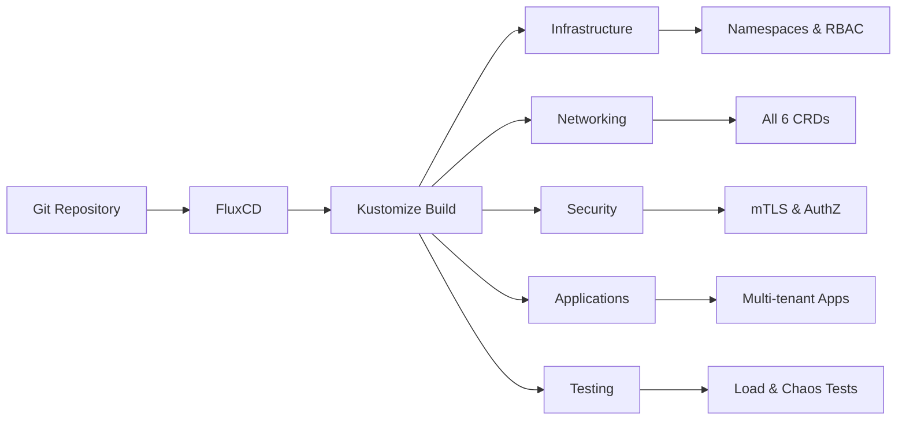

# Istio Multi-Tenant Service Mesh Deployment

This repository contains a comprehensive, organized Istio service mesh deployment with all 6 core Istio CRDs, multi-tenant architecture, and extensive testing infrastructure for GitOps deployment.

## 🏗️ Architecture Overview

```
istio-apps/
├── base/                           # Infrastructure Foundation
│   ├── namespaces.yaml            # Multi-tenant namespace setup
│   └── rbac.yaml                  # Service accounts and RBAC
├── networking/                     # Core Istio Traffic Management (4 CRDs)
│   ├── gateways.yaml             # 🌐 Gateway - HTTPS ingress with TLS
│   ├── virtual-services.yaml     # 🔀 VirtualService - Traffic routing & canary
│   ├── destination-rules.yaml    # ⚖️ DestinationRule - Load balancing & circuit breakers
│   ├── service-entries.yaml      # 🌍 ServiceEntry - External service integration
│   └── sidecars.yaml             # 📡 Sidecar - Namespace isolation
├── security/                       # Istio Security (2 CRDs)
│   ├── authorization-policies.yaml # 🔐 AuthorizationPolicy - Multi-tenant RBAC
│   └── peer-authentication.yaml   # 🔑 PeerAuthentication - mTLS policies
├── apps/                          # Multi-tenant Applications
│   ├── tenant-a/                  # Production environment (strict security)
│   │   ├── podinfo-v1.yaml       # Baseline production version
│   │   ├── podinfo-v2.yaml       # Canary deployment version
│   │   ├── podinfo-service.yaml  # Service definitions
│   │   ├── redis.yaml            # Tenant-specific cache
│   │   └── kustomization.yaml    # Production kustomization
│   ├── tenant-b/                  # Development environment (relaxed policies)
│   │   ├── podinfo-v1.yaml       # Development baseline
│   │   ├── podinfo-v2.yaml       # Primary development version
│   │   ├── podinfo-v3.yaml       # Experimental features
│   │   ├── podinfo-service.yaml  # Development services
│   │   ├── redis.yaml            # Development cache
│   │   └── kustomization.yaml    # Development kustomization
│   └── shared-services/           # Infrastructure services
│       ├── monitoring-stack.yaml # Prometheus + Grafana
│       ├── jaeger-tracing.yaml   # Distributed tracing
│       ├── redis-cluster.yaml    # Shared Redis cluster
│       └── kustomization.yaml    # Shared services kustomization
├── testing/                       # Testing and Validation
│   ├── load-generator.yaml       # Automated load testing
│   └── external-test-client.yaml # External connectivity testing
├── kustomization.yaml             # Main kustomization file
└── README.md                      # This file
```

## 🎯 Features Implemented

### ✅ All 6 Core Istio CRDs Deployed

1. **Gateway** - HTTPS ingress with cert-manager integration
2. **VirtualService** - Canary deployments, A/B testing, fault injection
3. **DestinationRule** - Circuit breakers, load balancing, outlier detection
4. **ServiceEntry** - External APIs (HTTPBin, GitHub, Azure services)
5. **Sidecar** - Namespace isolation and performance optimization
6. **AuthorizationPolicy** - Multi-tenant security boundaries

### 🏢 Multi-Tenant Architecture

- **tenant-a**: Production-like (strict security, 90/10 canary)
- **tenant-b**: Development (relaxed policies, experimental features)
- **shared-services**: Infrastructure (monitoring, tracing, cache)
- **external-services**: External API gateway
- **istio-testing**: Chaos engineering and load testing

### 🔒 Security Implementation

- **mTLS**: Strict mode for production, permissive for development
- **RBAC**: Namespace-based isolation with service account permissions
- **Network Policies**: Sidecar configurations prevent cross-tenant access
- **Pod Security**: Non-root containers, read-only filesystems, security contexts

### 📊 Observability Stack

- **Prometheus**: Metrics collection with service discovery
- **Grafana**: Dashboards for Istio and application metrics
- **Jaeger**: Distributed tracing for request flows
- **ServiceMonitor**: Automatic Prometheus scraping configuration

### 🧪 Testing Infrastructure

- **Load Generator**: Continuous traffic generation for all tenants
- **Chaos Engineering**: Fault injection and resilience testing
- **External Connectivity**: Validates ServiceEntry configurations
- **Performance Testing**: Fortio-based baseline performance measurement
- **Debug Tools**: Manual testing and troubleshooting capabilities

## 🚀 Deployment Strategy

### GitOps Deployment Flow



### Resource Application Order

1. **Infrastructure** (namespaces, RBAC)
2. **Networking** (gateways, virtual services, destination rules)
3. **Security** (authorization policies, peer authentication)
4. **Applications** (podinfo deployments, services)
5. **Testing** (load generators, chaos engineering)

## 📋 Configuration Details

### Domain Configuration

- **Production**: `podinfo.tenant-a.davidmarkgardiner.co.uk`
- **Development**: `podinfo.tenant-b.davidmarkgardiner.co.uk`
- **Monitoring**: `monitoring.shared-services.davidmarkgardiner.co.uk`
- **Testing**: `*.istio-testing.davidmarkgardiner.co.uk`

### Traffic Routing

- **Tenant A**: 90% v1, 10% v2 (production canary)
- **Tenant B**: Primary v2, fallback v1 (development)
- **Canary Header**: `canary: true` routes to v2
- **A/B Testing**: Mobile user agents get 50/50 split

### Resource Limits

- **Production Pods**: 128Mi memory, 100m CPU
- **Development Pods**: 128Mi memory, 200m CPU
- **Shared Services**: Higher limits for monitoring stack
- **Testing Pods**: Varied limits for load testing scenarios

## 🔧 Operations Guide

### Deployment Commands

```bash
# Apply all resources
kubectl apply -k .

# Apply specific components
kubectl apply -k networking/
kubectl apply -k security/
kubectl apply -k apps/tenant-a/
```

### Monitoring Commands

```bash
# Check all Istio resources
kubectl get gateway,virtualservice,destinationrule,serviceentry,sidecar,authorizationpolicy -A

# Check application status
kubectl get pods,svc -n tenant-a
kubectl get pods,svc -n tenant-b
kubectl get pods,svc -n shared-services

# Check Istio proxy status
kubectl get pods -n aks-istio-system
```

### Testing Commands

```bash
# Manual traffic testing
curl -H "Host: podinfo.tenant-a.davidmarkgardiner.co.uk" http://$INGRESS_IP/
curl -H "Host: podinfo.tenant-a.davidmarkgardiner.co.uk" -H "canary: true" http://$INGRESS_IP/

# Check load generator logs
kubectl logs -n istio-testing deployment/load-generator -f

# Access debug pod
kubectl exec -n istio-testing debug-client -it -- bash
```

### Troubleshooting

```bash
# Check Istio configuration
kubectl get istio-proxy -n tenant-a

# Validate configurations
istioctl analyze

# Check proxy configuration
istioctl proxy-config cluster podinfo-v1-xxx.tenant-a
```

## 🎯 Testing Scenarios

### Canary Deployment Testing

1. Traffic split validation (90/10 distribution)
2. Canary header routing (`canary: true`)
3. Mobile user agent A/B testing
4. Fault injection testing

### Security Testing

1. Cross-tenant isolation validation
2. mTLS connection verification
3. Authorization policy enforcement
4. External service access control

### Resilience Testing

1. Circuit breaker activation
2. Retry policy validation
3. Timeout handling
4. Chaos engineering scenarios

### Performance Testing

1. Load testing with Fortio
2. Latency measurement
3. Throughput benchmarking
4. Resource utilization monitoring

## 📈 Metrics and Monitoring

### Key Metrics Collected

- **Request Rate**: Requests per second by service/version
- **Error Rate**: 4xx/5xx error percentage
- **Response Time**: P50, P95, P99 latencies
- **Circuit Breaker**: Open/closed state and activation count
- **mTLS**: Connection success/failure rates

### Grafana Dashboards

- Istio Service Mesh overview
- Podinfo application metrics
- Multi-tenant security monitoring
- External service connectivity

## 🏁 Ready for Production

This deployment includes:

- ✅ All 6 Istio CRDs with comprehensive examples
- ✅ Multi-tenant security with proper isolation
- ✅ Comprehensive observability and monitoring
- ✅ Automated testing and validation
- ✅ Production-ready security configurations
- ✅ GitOps-ready kustomization structure

The setup demonstrates enterprise-grade Istio service mesh patterns suitable for production workloads with proper security, observability, and operational procedures.
