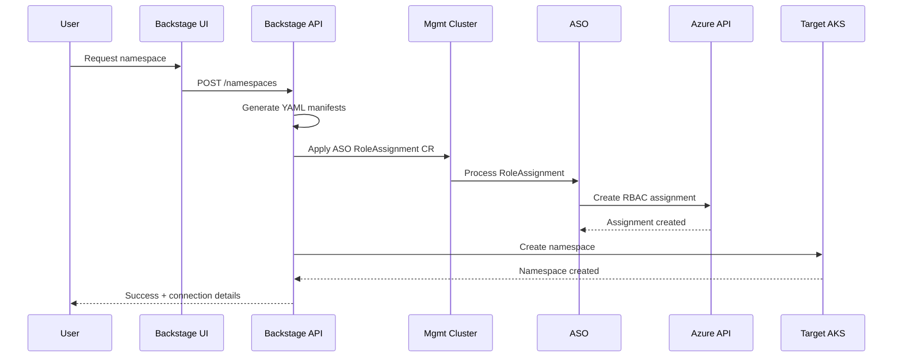

This is a clever approach to automating namespace provisioning with proper RBAC controls! Let me break down the permissions and architecture needed for this setup.

## Required Permissions for the Backstage API

The Backstage API would need several layers of permissions:

### 1. **Kubernetes Permissions (Management Cluster)**
The API needs permissions on the management cluster where ASO (Azure Service Operator) is installed:

```yaml
apiVersion: rbac.authorization.k8s.io/v1
kind: ClusterRole
metadata:
  name: backstage-namespace-provisioner
rules:
- apiGroups: [""]
  resources: ["namespaces"]
  verbs: ["create", "get", "list", "watch"]
- apiGroups: ["authorization.azure.com"]
  resources: ["roleassignments"]
  verbs: ["create", "get", "list", "watch", "update"]
- apiGroups: ["managedidentity.azure.com"]
  resources: ["userassignedidentities", "federatedidentitycredentials"]
  verbs: ["create", "get", "list", "watch"]
```

### 2. **Azure Permissions (via ASO's Service Principal)**
The ASO operator itself needs these Azure permissions:
- `Microsoft.Authorization/roleAssignments/write` - to create role assignments
- `Microsoft.Authorization/roleAssignments/read` - to verify assignments
- `Microsoft.ContainerService/managedClusters/read` - to access AKS cluster details
- `Microsoft.ManagedIdentity/userAssignedIdentities/read` - if using managed identities

### 3. **Target AKS Cluster Permissions**
For creating the namespace on the target AKS cluster:
- The management cluster needs credentials to connect to target AKS clusters
- Could use Azure AD Workload Identity or stored kubeconfig

## Architecture Flow

Here's how I envision this working:



## Sample Implementation

The Backstage API would dynamically generate YAML like this:

```yaml
# 1. Create the namespace on target cluster
apiVersion: v1
kind: Namespace
metadata:
  name: team-alpha-dev
  labels:
    team: alpha
    environment: dev
    provisioned-by: backstage

---
# 2. ASO RoleAssignment for Azure RBAC
apiVersion: authorization.azure.com/v1api20200801preview
kind: RoleAssignment
metadata:
  name: team-alpha-dev-admin
  namespace: aso-system  # Where ASO operator runs
spec:
  owner:
    armId: /subscriptions/{sub-id}/resourceGroups/{rg}/providers/Microsoft.ContainerService/managedClusters/{cluster-name}
  principalId: "{user-or-group-object-id}"  # From request
  roleDefinitionId: /subscriptions/{sub-id}/providers/Microsoft.Authorization/roleDefinitions/b1ff04bb-8a4e-4dc4-8eb5-8693973ce19b  # Azure Kubernetes Service RBAC Admin
  scope: /subscriptions/{sub-id}/resourceGroups/{rg}/providers/Microsoft.ContainerService/managedClusters/{cluster-name}/namespaces/team-alpha-dev
```

## Key Considerations

1. **Namespace Scope in Azure RBAC**: Azure RBAC for AKS supports namespace-level scoping as of recent updates. The scope would be:
   ```
   /subscriptions/{sub}/resourceGroups/{rg}/providers/Microsoft.ContainerService/managedClusters/{cluster}/namespaces/{namespace}
   ```

2. **Authentication Flow**: Consider using:
   - Managed Identity for ASO authentication to Azure
   - OIDC/OAuth2 for user authentication to Backstage
   - Map user identities to Azure AD principals

3. **Multi-cluster Support**: Store cluster configurations in Backstage:
   ```javascript
   const clusterConfig = {
     "prod-cluster-1": {
       armId: "/subscriptions/.../managedClusters/prod-1",
       endpoint: "https://prod-1.region.azmk8s.io",
       resourceGroup: "rg-prod"
     }
   };
   ```

4. **Audit & Compliance**: 
   - Log all provisioning requests
   - Store role assignment metadata in Backstage catalog
   - Implement approval workflows for production namespaces

5. **Error Handling**: Handle cases where:
   - Namespace already exists
   - User lacks permissions in Azure AD
   - ASO operator is down
   - Network connectivity issues

This approach makes the process fully automated and repeatable while maintaining security through proper RBAC controls. The management cluster acts as a control plane for multi-cluster namespace provisioning.